..  _ot-json:

OT-JSON Structure
=================

Dataset structure
------------------

OT-JSON dataset is the main structure of objects that are transferred in the OriginTrail network. The structure of dataset consists of **dataset header**, **dataset graph** and **dataset signature**. Dataset header contains dataset metadata, such as dataset timestamp, data creator information, transpiler data, verification schemes versions etc.
Identifier of a dataset is calculated as a SHA3-256 digest of dataset header and dataset graph sections. Dataset signature is calculated for the canonicalized form of the entire, unsigned, dataset object.

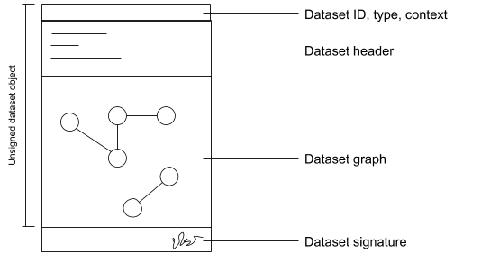

*Figure 1.*  Graphic representation of a dataset

**Example**

.. code::

    {
      "@type": "Dataset",
      "@id": "0x123456789034567894567890",
      "datasetHeader": {...},
      "@graph": [...],
      "signature": {...}
    }

*Example 1.* Dataset structure example

Attribute definitions
~~~~~~~~~~~~~~~~~~~~~~

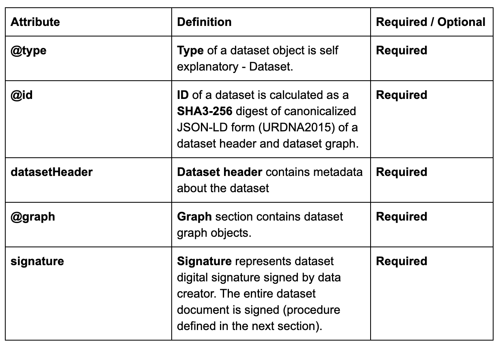

Dataset header
~~~~~~~~~~~~~~~

Dataset header contains metadata information about dataset, transpilation process from:

    - Version of OT-JSON document
    - Dataset creation timestamp
    - Dataset title
    - Dataset tags
    - Related datasets
    - Validation schemas
    - Data validation information
    - Data creator
    - Transpilation information

.. code:: json

    {
        "datasetHeader": {
            "OTJSONVersion": "1.0",
            "datasetCreationTimestamp": "2019-01-15T09:43:58Z",
            "datasetTitle": "",
            "datasetTags": ["gs1-datasets", "..."],

            "relatedDatasets": [{
               "datasetId": "0x232134875876125375761936",
               "relationType": "UPDATED",
               "relationDescription": "...",
               "relationDirection": "direct"
            }],

            "validationSchemas": {
              "erc725-main": {
                "schemaType": "ethereum-725",
                "networkId": "1",
                "networkType": "private",
                "hubContractAddress": "0x2345678902345678912321"
              },

              "merkleRoot": {
                "schemaType": "merkle-root",
                "networkId": "1",
                "networkType": "private",
                "hubContractAddress": "0x2345678902345678912321"
              }
            },

            "dataIntegrity": {
              "proofs": [
                {
                  "proofValue": "0x54364576754632364577543",
                  "proofType": "merkleRootHash",
                  "validationSchema": "/schemas/merkleRoot"
                }
              ],
            },

            "dataCreator": {
              "identifiers": [
                 {
                  "identifierValue": "0x213182735128735218673587612",
                  "identifierType": "ERC725",
                  "validationSchema": "/schemas/erc725-main"
                 }
                ],
              },
            },

            "transpilationInfo": {
              "transpilerType": "GS1-EPCIS",
              "transpilerVersion": "1.0",
              "sourceMetadata": {
                "created": "",
                "modified": "",
                "standard": "GS1-EPCIS",
                "XMLversion": "1.0",
                "encoding": "UTF-8"
              },
              "diff": { "...": "..."}
        }
    }

*Example 2.* Dataset header structure example

Validation schemas
~~~~~~~~~~~~~~~~~~~~

Validation schemas are objects that provide information on how to validate specific values, like identifiers and hashes. Schemas can contain addresses of smart contracts where identifiers are created, network identities, locations of proof hashes, etc.

Attribute definitions
~~~~~~~~~~~~~~~~~~~~~~

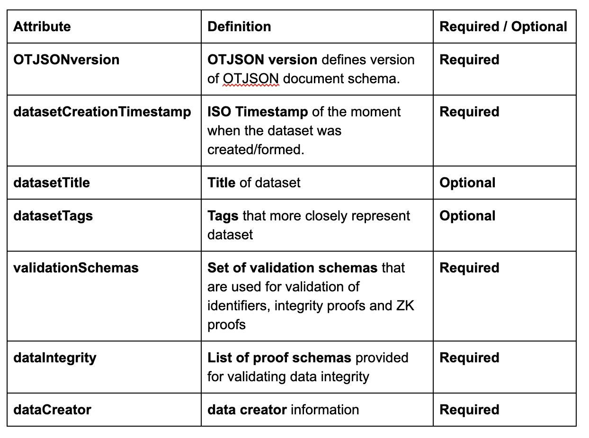

Hash structure
---------------

OT-JSON document is uniquely identified with data hash and root hash. Those hashes are generated from the OT-JSON graph object which stores a user defined data.
Before calculating dataset hashes it is important to determine a uniform order of objects in OT-JSON object in order to always obtain the same hash values.
When a user imports a dataset, depending on the standard, OT-Node converts the dataset to OT-JSON format, sorts the dataset and calculates data hash and root hash.

OT-JSON service supports 1.0 and 1.1 versions which differ in sorting algorithms.
OT-JSON 1.0 version service sorts the entire dataset before calculating hash values and saves unsorted dataset in the graph database.
OT-JSON 1.1 version service sorts the entire dataset **except arrays in properties** and saves sorted dataset in graph database.
The new version of OT-JSON service improves overall performance and ensures data integrity by sorting datasets during the import process and when reading data from graph database.
Such an approach ensures that the dataset is always sorted during processing and only requires one sorting call for dataset processing functionalit, such as import or replication.

The following sequence diagrams describe the usage of sort methods for both versions of OT-JSON during the import process.

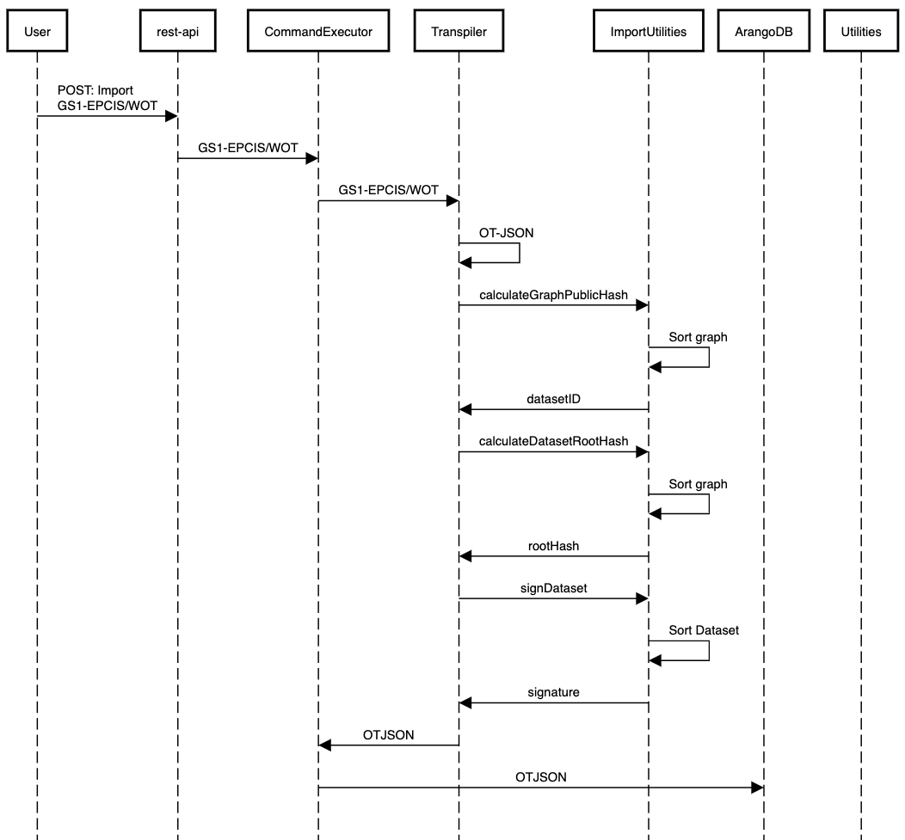

*Figure 2.*  Import process for OT-JSON version 1.0

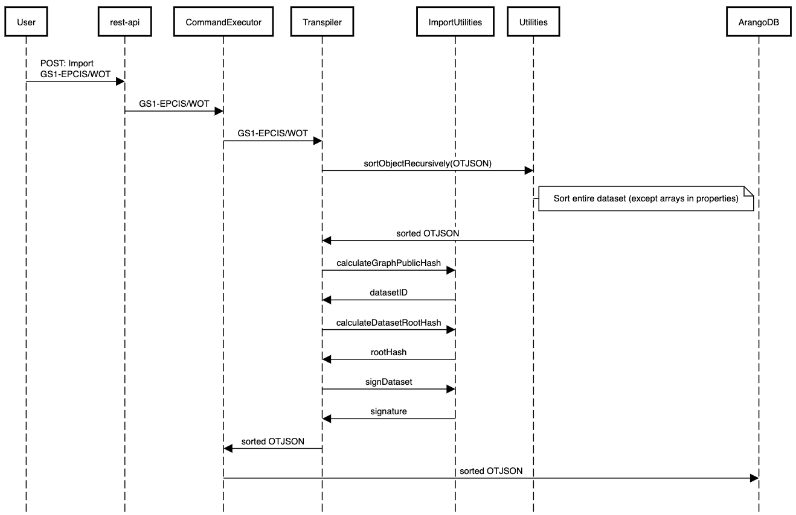

*Figure 3.*  Import process for OT-JSON version 1.1

Signing
--------

When the unsigned OT-JSON document is formed, resulting object is canonicalized (serialized) and prepared for signing by data creator. Dataset signing process can be done using different signature schemas/suits. The canonicalization of OT-JSON dataset is creating sorted stringified JSON object.

Structure of a signature object is defined according to selected signature suit specifications.
Signing is done using Koblitz elliptic curve signatures (Ethereum private keys).

Also, id using JSON-LD as a format for OT-JSON, Koblitz 2016 signature suit can be used.

**Example of JSON-LD Koblitz signature 2016 Signature Suite**

The entire JSON-LD dataset document is canonicalized using URDNA2015 algorithm for JSON-LD canonicalization. Resulting N-QUADS data is digested using SHA256 algorithm. Finally, the digest is signed with ECDSA private key using Koblitz elliptic curve. Koblitz curve is used for generating Ethereum and Bitcoin wallets, so private keys for Ethereum and Bitcoin wallets can be used for signing.

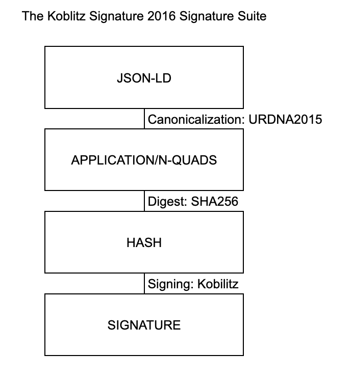

*Figure 4.*  Diagram of dataset signing procedure using Koblitz Signature 2016 Signature Suite

Object structure
-----------------

OT-JSON dataset objects represent entities which can be interconnected with relations in a graph-like form. Every OT-JSON dataset object is required to have it’s **unique identifier** (@id),
**type** (@type) and **signature**. Other, optional, sections include identifiers, properties, related objects, attachments.

Attribute definitions
~~~~~~~~~~~~~~~~~~~~~~

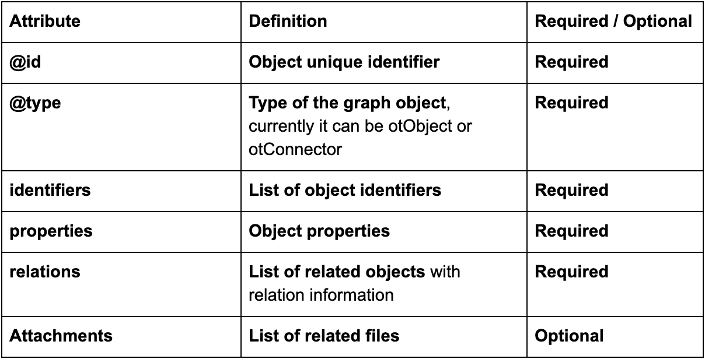

.. code:: json

    {
        "@id": "<UNIQUE_OBJECT_IDENTIFIER>",
        "@type": "<OBJECT_TYPE>",

        "identifiers": ["..."],

        "properties": {"...": "..."},

        "relatedObjects": ["..."],

        "attachments": ["..."],

        "signature": {"...": "..."}
    }

*Example 3.* Dataset object structure template

Object identifiers section
~~~~~~~~~~~~~~~~~~~~~~~~~~~

Object identifiers section is a list of objects that represent identifier values for certain object.
Identifier objects contain information about **identifier type**, **identifier value**, and **validation schema** that is used for validating identity.

.. code:: json

    {
        "identifiers": [
            {
                "identifierType": "sgtin",
                "identifierValue": "1234567.0001",
                "validationSchema": "/datasetHeader/validationSchemas/urn:ot:sgtin"
            },
            {
                "identifierType": "sgln",
                "identifierValue": "3232317.0001",
                "validationSchema": "/datasetHeader/validationSchemas/urn:ot:sgln"
            }
        ]
    }

*Example 4.* Example of identifiers section

Attribute definitions
~~~~~~~~~~~~~~~~~~~~~~

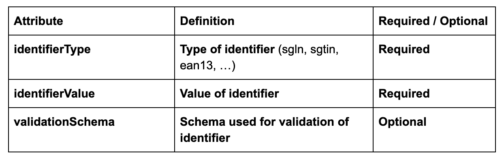

Object properties section
~~~~~~~~~~~~~~~~~~~~~~~~~~

Object properties section is defined as container for all object property attributes. OT-JSON does not provide specific rules for structuring object properties, those rules are defined within recommendations and data formatting guidelines.

Object Related objects section
~~~~~~~~~~~~~~~~~~~~~~~~~~~~~~~

Related objects section is a list of objects that represent information about other objects that are related with the object and definitions of those relations.
Objects in related objects list contain information about **linkedObject** (@id), **related object type** (@type), **relation direction**, **properties** containing additional information about the relation
and **relation type**.

.. code:: json

    {
        "relations": [
            {
                "@type": "OTRelation",
                "linkedObject": {
                    "@id": "<OBJECT ID>",
                },
                "properties": {"..." : "..."},
                "relationType": "PART_OF",
                "direction": "direct"
            }
        ]
    }

*Example 5.* Example of related entities section

Attribute definitions
~~~~~~~~~~~~~~~~~~~~~~

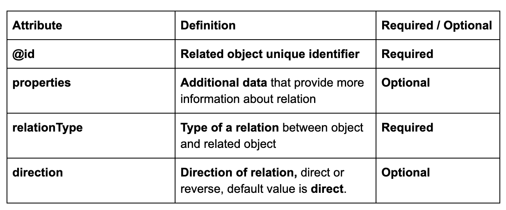

Attachments section
~~~~~~~~~~~~~~~~~~~~

Attachments section contains a list of objects that represent metadata about files that are related with the object.
Objects in attachment section list contain information about related **file id** (@id, as URI), **attachment type** (@type),
**attachment role** (such as certificate, lab results, etc.), **attachment description**, **attachment file type**, and **SHA3-256** digest of a file content.

.. code:: json

    {
        "attachments": [
            {
                "@id": "0x4672354967832649786379821",
                "@type": "Attachment",
                "attachmentRole": "Certificate",
                "attachmentDescription": "...",
                "fileUri": "/path/file.jpg",
                "metadata": {
                    "fileType": "image/jpeg",
                    "fileSize": 1024
                }
            }
        ]
    }

*Example 6.* Example of attachments section

Attribute definitions
~~~~~~~~~~~~~~~~~~~~~~

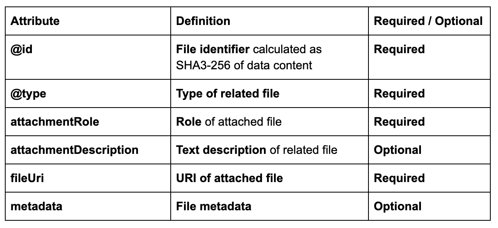

Connector objects
------------------

Special type of graph objects are **Connectors**. Connectors are used to connect data from multiple datasets of possibly different data providers.
Every connector contains *connectionId* attribute, which represents value on which connectors are connected to each other. Also, the list expectedConnectionCreators contains list of data creators that are allowed to connect to a connector.

.. code:: json

    {
        "@type": "OTConnector",
        "connectionId": "1A794-2019-01-01",
        "expectedConnectionCreators": [
            {
                "identifierType": "ERC725",
                "identifierValue": "0x5678456976546485645749",
                "validationSchema": "../ethereum-erc",
            }
        ]
    }

*Example 7.* Example of attachments section

OT-JSON Versions
----------------

In order to improve the simplicity and consistency of generating data integrity values, such as dataset signatures,
dataset IDs and dataset root hashes, there have been revisions to how dataset integrity values are calculated.
These revisions have been created in order to preserve the ability to validate the integrity of datasets already published
to the network.

The differences between OT-JSON versions are in how data is ordered when generating three different data integrity values:

1. ``datasetID`` , which is generated as a hash of the ``@graph`` section of the dataset, and is used to verify data integrity of the dataset
2. ``rootHash`` , which is generated as a hash of the ``@graph`` section along with the dataset creator, and is used for verifying the dataset creator
3. ``signature``, which is generated as a signed hash of the entire dataset, and is used to verify the creator and integrity of a dataset off chain.

OT-JSON 1.0
~~~~~~~~~~~

The ``datasetID`` for OT-JSON 1.0 is generated out of the ``@graph`` section after
**sorting every object and array, including the** ``@graph`` **array**.

The ``rootHash`` for OT-JSON 1.0 is generated out of the ``@graph`` section after
**sorting the relations and identifiers of each element, and sorting the** ``@graph`` **array by each array element** ``@id``.

The ``signature`` for OT-JSON 1.0 is generated out of the dataset after first
**sorting the relations and identifiers of each element, and sorting the** ``@graph`` **array by each array element** ``@id``,
and then **sorting every object in the dataset**.

OT-JSON 1.1
~~~~~~~~~~~

.. note::

    **OT-JSON 1.1** was introduced in order to have the same sorting method for generating hashes. Along with that,
    sorting of arrays was removed in order to prevent unintentionally changing user defined data
    (such as properties of OT-JSON objects).

The ``datasetID`` for OT-JSON 1.1 is generated out of the ``@graph`` section after
**sorting every object in the the** ``@graph`` **array, without changing the order of any array**.

The ``rootHash`` for OT-JSON 1.1 is generated out of the ``@graph`` section in the same was as it is for the ``datasetID``.

The ``signature`` for OT-JSON 1.1 is generated out of the dataset when the ``datasetHeader`` is attached.

OT-JSON 1.2
~~~~~~~~~~~

.. note::

    **OT-JSON 1.2** was introduced in order to sort the dataset when generating a signature. Along with that, sorting of
    non user generated arrays (such as identifiers and relations) was reimplemented.

The ``datasetID`` for OT-JSON 1.1 is generated out of the ``@graph`` section after
**sorting every object and array, including the the** ``@graph`` **array, without changing the order of any array inside of a properties object**.

The ``rootHash`` for OT-JSON 1.1 is generated out of the ``@graph`` section in the same was as it is for the ``datasetID``.

The ``signature`` for OT-JSON 1.1 is generated out of the dataset when the ``datasetHeader`` is attached,
**after sorting the dataset in the same way it was done for** ``datasetID`` **and** ``rootHash``.

Sorting differences overview
~~~~~~~~~~~~~~~~~~~~~~~~~~~~

Below is an image visually showing the differences of how the data integrity values are calculated between the OT-JSON versions

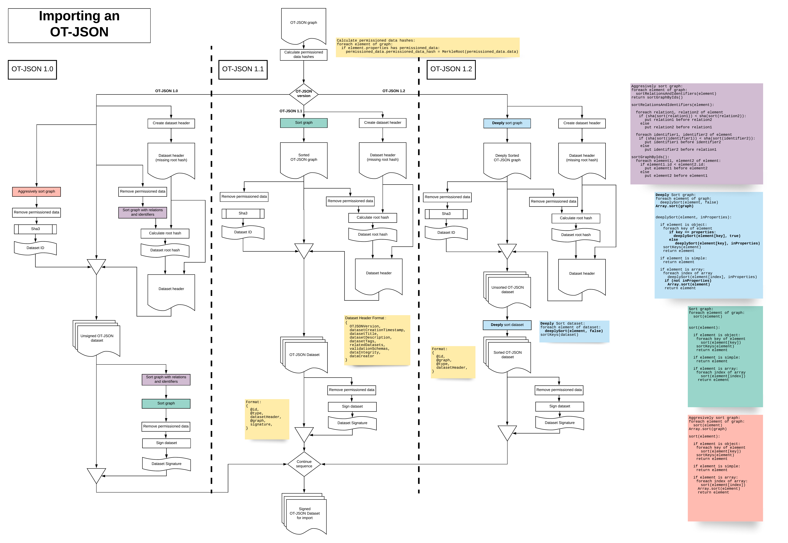

