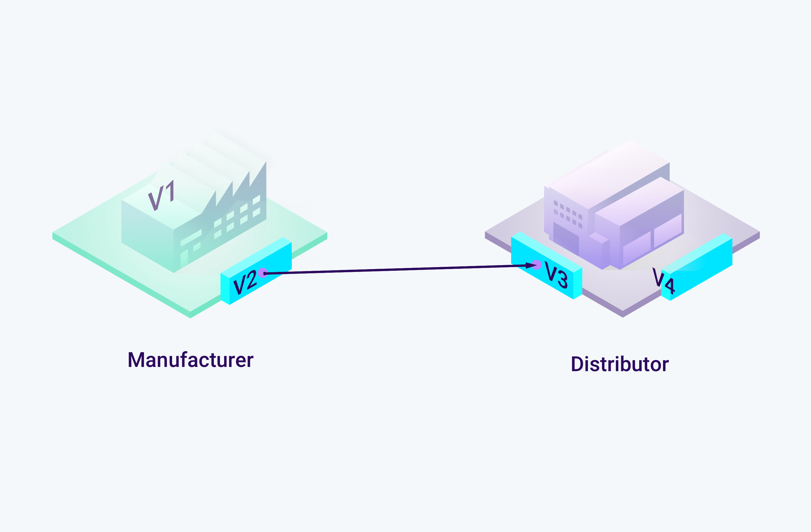
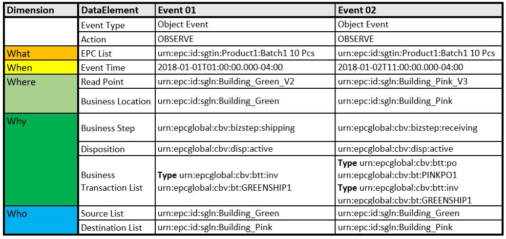
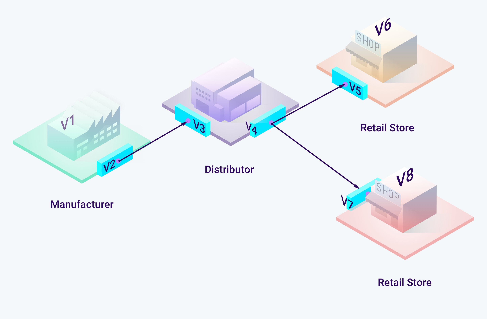
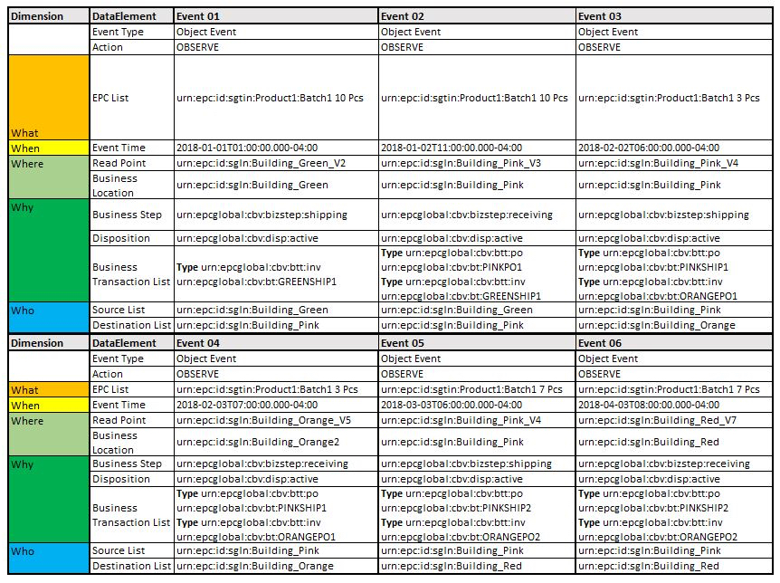

.. _xml-epcis-examples:

XML EPCIS Examples
====================

Provided examples describe proposed data structure and data flow. The
main goal is to elaborate data structuring process and features on ODN.
We have set out simple Manufacturer-Distributor-Retail (MDR) supply
chain where goods move only forward.

Supply chain consists of 4 entities:

-  Green - Manufacturer of wine
-  Pink - Distributor of beverages
-  Orange and Red - Retail shops

For clarity and analysis examples deal with generic items called
Product1 and generic locations (with generic read points). Real life use
cases should utilize GS1 identifiers for values (GLN,GTIN...). For
example, instead value ``urn:epc:id:sgln:Building_Green`` there should
be GLN number like ``urn:epc:id:sgln:0614141.12345.0``.

1. Basic sales example
~~~~~~~~~~~~~~~~~~~~~~~~~~~~~

**Supply chain participants map:**

**Use case:** Green is producing wine and selling it to Pink. Shipping
and receiving events are generating data that is being processed on ODN.

**GS1 EPCIS design:**

`Sample files`_

2. Complex manufacturer-distributor-retail (MDR) sale
~~~~~~~~~~~~~~~~~~~~~~~~~~~~~~~~~~~~~~~~~~~~~~~~~~~~~~~~~~

**Supply chain participants map:**

**Use case:** Green is producing wine and selling it to Pink. Pink is
distributing (selling) wine to retail shop (Orange). Batches on Pink are
sold partially. Shipping and receiving events are generating data that
is being processed on ODN.

`GS1 EPCIS design`_

`Sample files <https://github.com/OriginTrail/ot-node/blob/develop/importers/xml_examples/Retail/>`__

.. _Sample files: https://github.com/OriginTrail/ot-node/blob/develop/importers/xml_examples/
.. _`GS1 EPCIS design`: https://github.com/OriginTrail/ot-node/blob/develop/importers/xml_examples/Retail/Design.JPG