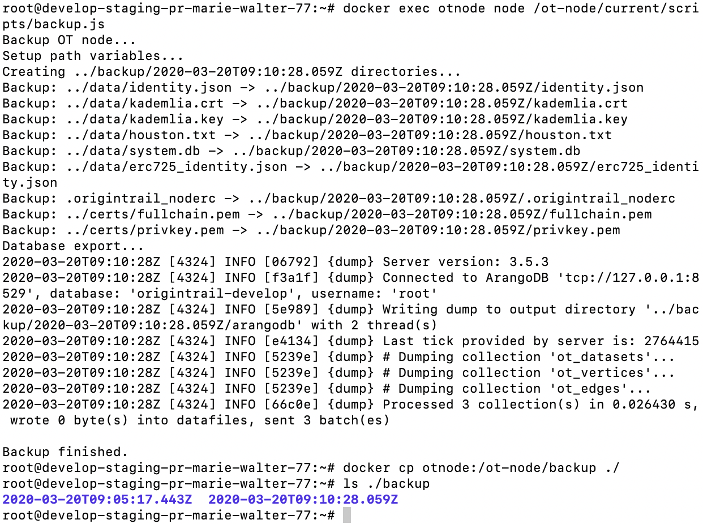

Backup and restore
==================

Introduction
------------

If you've found your node failing due to some unexplained error, a clean docker image might remove the issue. But just downloading a new docker image would cause your node to lose the data it's currently holding, making it susceptible to litigation and loss of tokens. So here we guide you through the process of how to reinstall your ot-node while keeping all the data necessary for your node to keep its jobs.

⚠️ Before you start ⚠️
~~~~~~~~~~~~~~~~~~~~~~

Make sure your node is running the latest version of ot-node. This tutorial downloads the latest version of the code and using different ot-node versions for backing up and restoring your node can cause issues

Step 1/3: Backing up your data
------------------------------

The first thing to do is to back up your files and store them outside your docker so that you can delete the container and install a new one. Run the following commands to create a backup

.. code:: bash

    docker exec otnode node /ot-node/current/scripts/backup.js
    docker cp otnode:/ot-node/backup ./
    ls ./backup

These commands should show something similar to the following image

Step 2/3: Reinstalling your docker image
----------------------------------------

Now we can stop the container and download a new one. Run the following commands:

.. code:: bash

    docker stop otnode
    docker rm otnode
    imageId=$(docker images | grep otnode | awk '{print $3}')
    docker rmi $imageId

Now you've successfully removed your image, and can download a new one.Run the following command to download a new docker image

.. code:: bash

    sudo docker create -i --log-driver json-file --log-opt max-size=1g --name=otnode -p 8900:8900 -p 5278:5278 -p 3000:3000 -v ~/.origintrail_noderc:/ot-node/.origintrail_noderc quay.io/origintrail/otnode:release_mainnet

Note: If you're running a testnet node, just replace mainnet with testnet in the command. Also, thanks for helping us test new features, you rock!

The last thing to do is to put your backup into your new container.

Step 3/3: Restoring the node data
---------------------------------

Extract the restore script from the container with the following command

.. code:: bash

    docker cp otnode:/ot-node/current/scripts/restore.sh ./

And now run it:

.. code:: bash

    ./restore.sh

Alternatively, if you're running your node on the testnet, run the command like so:

.. code:: bash

    ./restore.sh --environment=testnet

That's it! Your node should be running now, you can go ahead and see the logs by running:

.. code:: bash

    docker logs otnode -f

Additional options
------------------

If you've backed up your files in a different place or are using a custom directory for your data on the node, you can edit those in the restore script.Run the following command to see all the options for the restore command:

.. code:: bash

    ./restore.sh --help