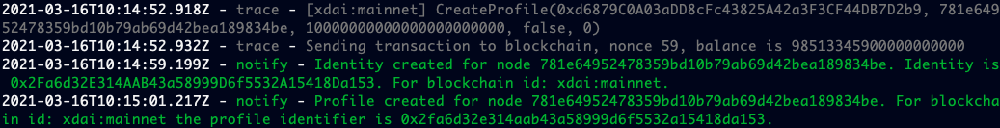

How to update your node from v4 to v5 and enable additional blockchains
=======================================================================

This article will guide you through updating your node to version v5 and enabling additional blockchain integrations.

⚠️ Before you start ⚠️
------------------------

Preparing your host machine
~~~~~~~~~~~~~~~~~~~~~~~~~~~

The newest ot-node update can require more memory than what the minimum required hardware specifies. This is why if you're
running the ot-node on a system with 2GB of memory we recommend that you do one of two things before you update your node:

    * Increase the amount of memory the host machine has. If you're running the node on a server **please stop your node with** ``docker stop otnode`` **before making changes to a server**.
    * Enable swap space on your machine. You can see how to do so `here <https://linuxize.com/post/create-a-linux-swap-file/>`_. Once you enable swap space please restart your node.

Command variables
~~~~~~~~~~~~~~~~~

In order to run the commands in this guide you will need to know the name of your docker container and the path to your node's configuration file.

In the commands listed below you should substitute ``DOCKER_CONTAINER_NAME`` with the docker container, and you should substitute ``NODE_RC_PATH`` with the path to your configuration file on your server.

.. note::

    If you followed the default installation instructions, your container name will be ``otnode`` and your configuration file path will be ``.origintrail_noderc`` (including the dot)

Checking node version
~~~~~~~~~~~~~~~~~~~~~

Before you start, make sure your ot-node is running on v4.1.17, which you can check by running the following command.

.. code:: bash

    docker logs DOCKER_CONTAINER_NAME | grep "Version check" | tail -1

The number beside the "local version" is your node's version. **If it is not 4.1.17 this guide will not work, please update your node to v4.1.17 before proceeding with this guide.**

Step 0: Back up your node data
~~~~~~~~~~~~~~~~~~~~~~~~~~~~~~

We strongly recommend backing up your node data before you update your node in case of an unexpected failure.
You can find the instructions on backing up your node data on the `Backup and Restore section <backup-and-restore.html>`__.
ou only need to complete the first step ("Backing up your node data") and you can safely continue with updating your node.

.. warning:: **If you do not backup your node it will not be possible to recover your node in case of an error, avoid this step at your own risk**

How to update your node configuration manually
----------------------------------------------

Open your node configuration file in an editor you're familiar with, for example nano

.. code:: bash

    nano .origintrail_noderc

Then apply the following changes:

1. Edit your blockchain section so that it contains an array called "implementations" which contains objects
~~~~~~~~~~~~~~~~~~~~~~~~~~~~~~~~~~~~~~~~~~~~~~~~~~~~~~~~~~~~~~~~~~~~~~~~~~~~~~~~~~~~~~~~~~~~~~~~~~~~~~~~~~~~

+------------------------------------+-------------------------------------+
|           Before                   |              After                  |
+====================================+=====================================+
| .. code-block:: json               |.. code-block:: json                 |
|                                    |                                     |
|   {                                |  {                                  |
|     "blockchain": {                |   "blockchain": {                   |
|        "rpc_server_url": "...",    |      "implementations": [           |
|        "...": "..."                |         {                           |
|     },                             |            "rpc_server_url": "...", |
|     "...": "..."                   |            "...": "..."             |
|   }                                |         }                           |
|                                    |      ]                              |
|                                    |   },                                |
|                                    |   "...": "..."                      |
|                                    |  }                                  |
|                                    |                                     |
+------------------------------------+-------------------------------------+

2. Move your node wallet values inside the blockchain implementation
~~~~~~~~~~~~~~~~~~~~~~~~~~~~~~~~~~~~~~~~~~~~~~~~~~~~~~~~~~~~~~~~~~~~

+--------------------------------------+----------------------------------------------+
|           Before                     |              After                           |
+======================================+==============================================+
| .. code-block:: json                 |.. code-block:: json                          |
|                                      |                                              |
|   {                                  |  {                                           |
|     "blockchain": {                  |    "blockchain": {                           |
|        "rpc_server_url": "...",      |       "implementations": [                   |
|        "...": "..."                  |         {                                    |
|     },                               |            "rpc_server_url": "...",          |
|     "node_wallet": "0x123...",       |            "node_wallet": "0x123...",        |
|     "node_private_key": "481...",    |            "node_private_key": "481...",     |
|     "management_wallet": "0xabc...", |            "management_wallet": "0xabc...",  |
|     "...": "..."                     |             "...": "..."                     |
|   }                                  |          }                                   |
|                                      |       ]                                      |
|                                      |    },                                        |
|                                      |    "...": "..."                              |
|                                      |   }                                          |
|                                      |                                              |
+--------------------------------------+----------------------------------------------+

3. If you have a custom ERC725 identity filepath set, move it also to the blockchain section and rename the parameter to "identity_filepath"
~~~~~~~~~~~~~~~~~~~~~~~~~~~~~~~~~~~~~~~~~~~~~~~~~~~~~~~~~~~~~~~~~~~~~~~~~~~~~~~~~~~~~~~~~~~~~~~~~~~~~~~~~~~~~~~~~~~~~~~~~~~~~~~~~~~~~~~~~~~~

+------------------------------------------------+-----------------------------------------------+
|           Before                               |              After                            |
+================================================+===============================================+
| .. code-block:: json                           |.. code-block:: json                           |
|                                                |                                               |
|   {                                            |  {                                            |
|     "blockchain": {                            |    "blockchain": {                            |
|        "rpc_server_url": "...",                |       "implementations": [                    |
|        "...": "..."                            |         {                                     |
|     },                                         |            "rpc_server_url": "...",           |
|     "node_wallet": "0x123...",                 |            "node_wallet": "0x123...",         |
|     "node_private_key": "481...",              |            "node_private_key": "481...",      |
|     "management_wallet": "0xabc...",           |            "management_wallet": "0xabc...",   |
|     "erc725_identity_filepath": "myid.json",   |            "identity_filepath": "myid.json",  |
|     "...": "..."                               |             "...": "..."                      |
|   }                                            |          }                                    |
|                                                |       ]                                       |
|                                                |    },                                         |
|                                                |    "...": "..."                               |
|                                                |   }                                           |
|                                                |                                               |
+------------------------------------------------+-----------------------------------------------+

4. If you have the "id" parameter specified in the "network" section, remove it so that is loaded from the default configuration
~~~~~~~~~~~~~~~~~~~~~~~~~~~~~~~~~~~~~~~~~~~~~~~~~~~~~~~~~~~~~~~~~~~~~~~~~~~~~~~~~~~~~~~~~~~~~~~~~~~~~~~~~~~~~~~~~~~~~~~~~~~~~~~~

+------------------------------------------------+-----------------------------------------------+
|           Before                               |              After                            |
+================================================+===============================================+
| .. code-block:: json                           |.. code-block:: json                           |
|                                                |                                               |
|   {                                            |  {                                            |
|     "network": {                               |    "network": {                               |
|       "id": "MainnetV4.0",                     |      "remoteWhitelist": ["..."],              |
|       "remoteWhitelist": ["..."],              |      "...": "..."                             |
|       "...": "..."                             |    },                                         |
|     },                                         |    "...": "..."                               |
|     "...": "..."                               |  }                                            |
|   }                                            |                                               |
|                                                |                                               |
|                                                |                                               |
+------------------------------------------------+-----------------------------------------------+

5. Add the new necessary fields, "blockchain_title" and "network_id", to the blockchain implementation:
~~~~~~~~~~~~~~~~~~~~~~~~~~~~~~~~~~~~~~~~~~~~~~~~~~~~~~~~~~~~~~~~~~~~~~~~~~~~~~~~~~~~~~~~~~~~~~~~~~~~~~~

+------------------------------------------------+-----------------------------------------------+
|           Before                               |              After (for mainnet)              |
+================================================+===============================================+
| .. code-block:: json                           |.. code-block:: json                           |
|                                                |                                               |
|   {                                            |  {                                            |
|     "blockchain": {                            |    "blockchain": {                            |
|        "rpc_server_url": "...",                |       "implementations": [                    |
|        "...": "..."                            |         {                                     |
|     },                                         |            "blockchain_title": "Ethereum",    |
|     "node_wallet": "0x123...",                 |            "network_id": "ethr:mainnet",      |
|     "node_private_key": "481...",              |            "rpc_server_url": "...",           |
|     "management_wallet": "0xabc...",           |            "node_wallet": "0x123...",         |
|     "erc725_identity_filepath": "myid.json",   |            "node_private_key": "481...",      |
|     "...": "..."                               |            "management_wallet": "0xabc...",   |
|   }                                            |            "identity_filepath": "myid.json",  |
|                                                |             "...": "..."                      |
|                                                |          }                                    |
|                                                |       ]                                       |
|                                                |    },                                         |
|                                                |    "...": "..."                               |
|                                                |   }                                           |
|                                                |                                               |
+------------------------------------------------+-----------------------------------------------+

+------------------------------------------------+-----------------------------------------------+
|           Before                               |              After (for testnet)              |
+================================================+===============================================+
| .. code-block:: json                           |.. code-block:: json                           |
|                                                |                                               |
|   {                                            |  {                                            |
|     "blockchain": {                            |    "blockchain": {                            |
|        "rpc_server_url": "...",                |       "implementations": [                    |
|        "...": "..."                            |         {                                     |
|     },                                         |            "blockchain_title": "Ethereum",    |
|     "node_wallet": "0x123...",                 |            "network_id": "ethr:rinkeby:1",    |
|     "node_private_key": "481...",              |            "rpc_server_url": "...",           |
|     "management_wallet": "0xabc...",           |            "node_wallet": "0x123...",         |
|     "erc725_identity_filepath": "myid.json",   |            "node_private_key": "481...",      |
|     "...": "..."                               |            "management_wallet": "0xabc...",   |
|   }                                            |            "identity_filepath": "myid.json",  |
|                                                |             "...": "..."                      |
|                                                |          }                                    |
|                                                |       ]                                       |
|                                                |    },                                         |
|                                                |    "...": "..."                               |
|                                                |   }                                           |
|                                                |                                               |
+------------------------------------------------+-----------------------------------------------+

6. Restart your node and verify update
~~~~~~~~~~~~~~~~~~~~~~~~~~~~~~~~~~~~~~

Restart your node with the following command so that the changes are loaded into the node:

.. code:: bash

    docker restart otnode

After restarting, we recommend observing your node logs with the following command and watching for any errors that show up:

.. code:: bash

    docker logs otnode --tail 1000 -f

Once you see a log line stating ``OT Node started`` your node is successfully updated and running on the newest version, congratulations!

In case of any problems or questions, please direct your inquiries to the
`#v5-update OriginTrail Discord channel  <https://discord.gg/breb2qx57D>`__ to
get the quickest support by the OriginTrail community and core developers

If you have decided to enable xDAI support, please consult the :ref:`Enabling xDai<Enable XDai>` section to understand the procedure
and how it refers to tokens being used.

Your node identity on Ethereum will not change and there will be no additional transactions (cost) if you update your
configuration with only the Ethereum blockchain enabled. In case of any issues please get in touch via support@origin-trail.com

How to update your node automatically (both testnet and mainnet nodes)
----------------------------------------------------------------------

Step 1: Extract the migration script for updating the node
~~~~~~~~~~~~~~~~~~~~~~~~~~~~~~~~~~~~~~~~~~~~~~~~~~~~~~~~~~~

First run the following command:

.. code:: bash

    curl -O https://raw.githubusercontent.com/OriginTrail/ot-node/feature/update-migrate-script/scripts/migrate_to_v5.sh

This will extract the **migration script** from the docker container to your node server, which you need for the next step (step 2).

Step 2: Run the script
~~~~~~~~~~~~~~~~~~~~~~

Run the following command:

.. code:: bash

    chmod +x migrate_to_v5.sh

This will set the **migration script** as an executable file, enabling you to run it.

To update your node run the migration script with the following command:

.. code:: bash

    ./migrate_to_v5.sh --node_container_name=DOCKER_CONTAINTER_NAME --node_rc_path=NODE_RC_PATH

This command will adapt your configuration file to the new format required by OT-node v5,
install the new node version and restart your node so it starts running on the new version.

.. note::

    If you're using the default docker container name and configuration file path you can just run the command without
    any parameters (shown below) instead of the command shown above.

    .. code:: bash

        ./migrate_to_v5.sh

Step 3: Verifying the update
~~~~~~~~~~~~~~~~~~~~~~~~~~~~

After the migration script finishes executing, we recommend observing your node logs with the following command and watching for any errors that show up.

.. code:: bash

    docker logs DOCKER_CONTAINER_NAME --tail 1000 -f

Once you see a log line stating ``OT Node started`` your node is successfully updated and running on the newest version, congratulations!

In case of any problems or questions, please direct your inquiries to the
`#v5-update OriginTrail Discord channel  <https://discord.gg/breb2qx57D>`__ to
get the quickest support by the OriginTrail community and core developers

Step 4: Enabling additional blockchain integrations
~~~~~~~~~~~~~~~~~~~~~~~~~~~~~~~~~~~~~~~~~~~~~~~~~~~

Once you've updated your node to version 5 you can follow the steps below to enable newly introduced OriginTrail
blockchain implementations such as xDai on mainnet or an additional rinkeby implementation on testnet.

The instructions below explain how to enable the xDai implementation on a mainnet node, if you're running a testnet node
got to the :ref:`Testnet Update steps<Testnet Update>`.

.. _Enable XDai:

MAINNET UPDATE: Enabling xDai on OriginTrail mainnet
~~~~~~~~~~~~~~~~~~~~~~~~~~~~~~~~~~~~~~~~~~~~~~~~~~~~

Before you start: Acquiring funds
^^^^^^^^^^^^^^^^^^^^^^^^^^^^^^^^^
In order for your node to operate with the xDAI blockchain, you're going to need TRAC on xDAI and xDai tokens,
in the same way that your node needs TRAC and ETH to function on Ethereum.

    * To acquire xDai tokens, please check the `official xDAI docs on how to obtain xDAI tokens <https://www.xdaichain.com/for-users/get-xdai-tokens>`__.

    * To acquire TRAC on xDAI you should use the `xDai bridge <https://omni.xdaichain.com/>`__ (instructions on how to use the bridge are found `here <https://docs.tokenbridge.net/eth-xdai-amb-bridge/multi-token-extension/ui-to-transfer-tokens/transfer-erc20>`__) to transfer your TRAC tokens from Ethereum to xDai.

.. note:: For your OT node to run on xDAI blockchain you will need at least 3000 TRAC on xDAI as the minimum required stake to run an ODN node.

Edit your configuration
^^^^^^^^^^^^^^^^^^^^^^^

The first thing to do when implementing the xDai blockchain is to open your node **config file** (which is in the root
folder and by default it will be named ``.origintrail_noderc`` ).

In order to edit your config file, you should open it in a text editor and change it’s contents.
For example, if you're familiar with using the **nano** editor, you could run this command:

.. code:: bash

    nano .origintrail_noderc

Once you’ve opened the config file for editing, find the blockchain object and the "implementations" array and add
another object  to the config, so that it looks as follows:

.. code:: json

    {
        "implementations": [
            {
                "blockchain_title": "Ethereum",
                "network_id": "ethr:mainnet",
                "node_wallet": "your_wallet_address",
                "node_private_key": "your_wallet_private_key",
                "management_wallet": "your_management_wallet",
                "identity_filepath": "erc_725_identity.json",
                "rpc_server_url": "your_rpc_url"
            },
            {
                "blockchain_title": "xDai",
                "network_id": "xdai:mainnet",
                "node_wallet": "your_wallet_address",
                "node_private_key": "your_wallet_private_key",
                "management_wallet": "your_management_wallet",
                "identity_filepath": "xdai_identity.json"
            }
        ]
    }

Replace the values starting with **your\_**  (your_wallet_address, your_wallet_private_key, your_management_wallet, your_rpc_url)
with real values and save your changes.

.. note::

    You can use different wallets for different blockchain implementations, assuming you have the appropriate funds on
    the wallet you specified for each blockchain implementation (ETH and TRAC for the Ethereum implementation and
    xDai and xTRAC for the xDai implementation). In the case of Ethereum and xDAI, you can use the same wallet
    as they are compatible.

Restart your node
^^^^^^^^^^^^^^^^^

Once you've edited the config, restart your node by running the command below to apply the changes to your node.

.. code::

    docker restart DOCKER_CONTAINER_NAME

Once your node starts it should create a new blockchain identity and profile and start listening to blockchain events on the xDai blockchain.

You can verify that your node successfully connected to the xDai blockchain by checking that there is a log similar to
the one pictured below (notice the **xdai:mainnet** blockchain id)

After that your node will listen to blockchain events from the xDai blockchain and will accept offers that are published
via xDai. **Your node is successfully running on the xDai chain, congratulations!**

.. note::

    If you wish to set a custom ``dh_price_factor`` value, you should know that it should be specified inside the
    implementation object (for example, below the ``network_id`` parameter) and thus you need to add the parameter
    inside every blockchain implementation you have declared.

.. _Testnet Update:

TESTNET UPDATE: Enabling the additional rinkeby implementation for OriginTrail testnet nodes
~~~~~~~~~~~~~~~~~~~~~~~~~~~~~~~~~~~~~~~~~~~~~~~~~~~~~~~~~~~~~~~~~~~~~~~~~~~~~~~~~~~~~~~~~~~~

Before you start: Acquiring funds
^^^^^^^^^^^^^^^^^^^^^^^^^^^^^^^^^

In order to attach your node to the additional testnet rinkeby ODN implementation, you're going to need at least
3000 ATRAC tokens and 0.01 rinkeby Ether on your wallet.

To acquire the ATRAC, you can use the ODN-Faucet discord bot by joining our Discord server then sending a message with
``!fundme your_wallet_address`` (replace ``your_wallet_address`` with the actual wallet address). You can see an example
of how to do it in the image below:

Edit your configuration
^^^^^^^^^^^^^^^^^^^^^^^

The first thing to do when implementing the additional implementation is to open your node **config file** (which is in
the root folder and by default it will be named ``.origintrail_noderc`` ).

In order to edit your config file, you should open it in a text editor and change it’s contents.
For example, if you're familiar with using the **nano** editor, you could run this command:

.. code:: bash

    nano .origintrail_noderc

Once you’ve opened the config file for editing, find the blockchain object and the "implementations" array and add
another object  to the config, so that it looks as follows:

.. code:: json

    {
        "implementations": [
              {
                  "blockchain_title": "Ethereum",
                  "network_id": "ethr:rinkeby:1",
                  "node_wallet": "your_wallet_address",
                  "node_private_key": "your_wallet_private_key",
                  "management_wallet": "your_management_wallet",
                  "identity_filepath": "erc_725_identity.json",
                  "rpc_server_url": "your_rpc_url"
              },
              {
                  "blockchain_title": "xDai",
                  "network_id": "ethr:rinkeby:2",
                  "node_wallet": "your_wallet_address",
                  "node_private_key": "your_wallet_private_key",
                  "management_wallet": "your_management_wallet",
                  "identity_filepath": "rinkeby_2_identity.json",
                  "rpc_server_url": "your_rpc_url"
              }
        ]
    }

Replace the values starting with **your\_**  (your_wallet_address, your_wallet_private_key, your_management_wallet,
your_rpc_url) with real values and save your changes.

.. note::

    You can use different wallets for different blockchain implementations, assuming you have the appropriate funds
    on the wallet you specified for each blockchain implementation

Restart your node
^^^^^^^^^^^^^^^^^

Once you've edited the config, restart your node by running the command below to apply the changes to your node.

.. code:: bash

    docker restart DOCKER_CONTAINER_NAME

Once your node starts it should create a new blockchain identity and profile and start listening to blockchain events.

You can verify that your node successfully connected to the additional implementation by checking that there is a
log similar to the one pictured below  (notice the **ethr:rinkeby:2** blockchain id):

After that your node will listen to blockchain events from the additional implementation and will accept offers that
are replicated using it.
**Your node is successfully running on multiple blockchain implementations simultaneously, congratulations!**

In case of any problems or questions, please direct your inquiries to the
`#v5-update OriginTrail Discord channel  <https://discord.gg/breb2qx57D>`__ to
get the quickest support by the OriginTrail community and core developers
