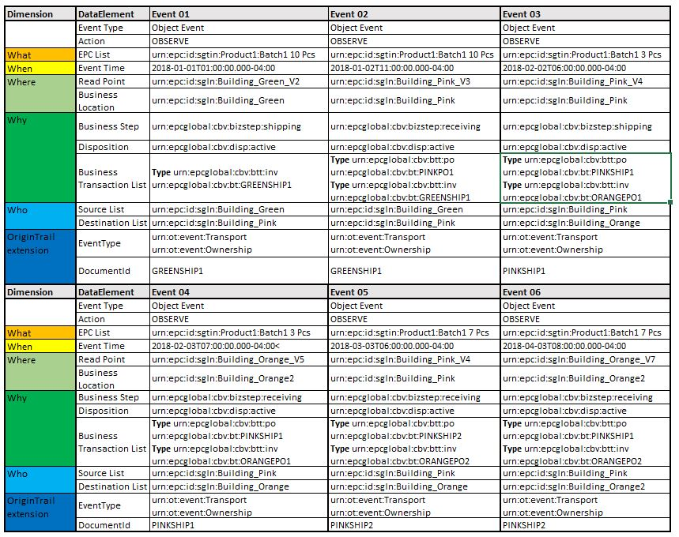

..  _data-structure-guidelines:

Data Structure Guidelines
=========================

This page illustrates how to structure data for OriginTrail protocol to
utilize data sharing and connectivity functionalities of the Alpha
version of the OriginTrail Distributed Network (ODN) as part of :ref:`data-layer`. It corresponds to
attachments and examples that are provided with this file and the
documentation on `GitHub`_. The defined structure was developed on the
best practices observed over the last several years of experience in
implementing transparency solutions within the food supply chain
industry, and is based on GS1 standards.

Problem definition
------------------------

OriginTrail is a protocol that enables exchange of standardized data
among disparate IT systems in multi organizational environments in a
tamper proof way. Therefore, each participant of the exchange should
provide their data in a common and standardized format. To utilize the
OriginTrail protocol to showcase its full potential,  the communication
from ERP systems of at least two entities within a supply chain towards
ODN needs to be established. The communication is done periodically by
sending standardized XML files to the OriginTrail network node, the
structure of which will be further explained in this document.

Also, OriginTrail stores and processes data that is generated and
received via IoT devices. This data usually is not stored within ERP
system. It is processed through designated software on read points into
JSON data format and then it is processed further. This type of data can
be handled with GS1 EPCIS standard and Web Of Things (WoT) standard.
Regardless which standard is used, ODN will process the data and store
it in graph database. If structured properly, related data from two data
sources (formats) will be interconnected.

The upload of data in the XML format to the OriginTrail protocol node is
performed via the web-service endpoint. The process of extracting data
from the ERP system, including its periodic forwarding to the
OriginTrail node API endpoint is out of the scope of this document. This
document focuses on the standardized data structure that data creator
nodes can process via their importer.

Types of data structure
------------------------------------

OriginTrail is primarily focused on GS1 data standards, but other
standards will also be supported.

1. `GS1 EPCIS standards`_.
2. `Web of things`_.

General data structure guidelines

1. Research and choose proper standa ODN according to defined use case
2. Choose data structure and download sample files
3. Edit sample files to match the use case.
4. Validate samples.
5. Create integration procedure that generates standardized files from
   data source and sends them to DC node.

GS1 EPCIS structure
~~~~~~~~~~~~~~~~~~~~~~~~~~~~~~

The goal of EPCIS is to enable disparate applications to create and
share visibility event data, both within and across enterprises.
Ultimately, this sharing is aimed at enabling users to gain a shared
view of physical or digital objects within a relevant business context.

The file structure is based on XML data format. Data structuring is
performed with use of official guidelines (EPCIS and CBV). Syntax and
XML node structure fully corresponds to GS1 standards and provided XSD
schemes. OriginTrail has introduced namespace (`urn:ot:\*`_ ) for custom
identifiers. OriginTrail namespace primarily introduces standardization
of attributes that will be used in graph vertexes, while values should
be according to GS1 namespace.

EPCIS data structuring guidelines
~~~~~~~~~~~~~~~~~~~~~~~~~~~~~~~~~~~~~~~~~~~~~~~~~~~~~

1. Research GS1 implementation guide and OriginTrail guidelines.
2. Collect the data samples that you want to store on ODN according to
   defined use case from official implementation guide and our
   documentation and download XSD schemes.
3. Connect XSD scheme and sample file in some advanced XML editing
   software
4. Modify sample file according to your data architecture and validate
   changes against XSD file.
5. Map your data structure with sample file.
6. Generate file from your ERP and evaluate the data against XSD file.
7. Send file to ODN via API through DC node.

GS1 EPCIS XML File structure
----------------------------

The XML file contains three main logical parts **document data**,
**master data** and **visibility events data**. All parts of the file
must be according to GS1 XSD scheme.

The example XML files, as well as the XSD scheme that can be found
`here`_. Example files are organized in several folders. Each folder
represents one use case scenario that has several events that are
described in details. Scenarios are described below in this document.

We strongly advise use of advanced XML editing software that will verify
if your data structure corresponds to XSD scheme that is proposed by GS1
if you want to have full compliance of the data structure.

Document data
~~~~~~~~~~~~~

EPCIS guideline suggests "Standard Business Document Header" `SBDH`_
standard for description of the document data. This part of data is in
EPCIS Header part of the file. It has basic information about file
(sender,receiver,ID,purpose...). Although OriginTrail is the receiver of
the file and it can be named as receiver (SBDH allows defining multiple
receivers) it is not necessary to include this. Receiver is some entity
involved in a business process, not in the data processing.

Master data
~~~~~~~~~~~

EPCIS standard describes 4 ways to process Master data. OriginTrail is
going to support the most common way - including Master data in the
Header of an EPCIS XML document. Master data will be processed
separately from other data. There is no need to include master data in
every file. Only data that has not been sent to ODN until that moment
should be provided. If there is already the same version of master data
on ODN, it will be omitted and not processed further. But if there is
visibility event data that is related to some master data that is not on
ODN, there can be query problems in graph database (the file is going to
be processed on ODN anyway).

More information about data :ref:`namespace`.

Visibility event data
~~~~~~~~~~~~~~~~~~~~~

Main focus of EPCIS standard is formalizing description of event data
that are generated by activities within supply chain. OriginTrail is
focusing on ObjectEvent, AggregationEvent and TransformationEvent that
are thoroughly described in the standard (although other event types are
also supported). We strongly advise to read `GS1 EPCIS implementation
guideline`_ and to evaluate our example files.

Event data describes interactions between entities described with master
data by the data creator. OriginTrail distinguishes two types event
data:

1. Internal events are related to processes of object movements or
   transformations (production, repackaging etc) within the scope of one
   supply chain participants business location (read point) as part of
   some business process. For example, this could be production or
   assembly transactions that result in product output for further
   production or sale (repackaging, labeling etc). Ownership of objects
   does not change during event. Consensus check is not necessary.

2. External events are related to processes between different supply
   chain participants (sales/purchases, transport). They represent
   processes where the jurisdiction or ownership of the objects gets
   changed in the supply chain. This type of events should use consensus
   check.

Each event should have a unique ID that connects GS1 event with
corresponding ERP transaction in database from the data creator. The
event data implies that the provider of that data is one of the active
participants in the transaction process.

OriginTrail Extension section
~~~~~~~~~~~~~~~~~~~~~~~~~~~~~

EPCIS standard allows extensions of their data set. Please read
`namespace`_ section for more details. Currently OriginTrail protocol
requires following extensions:

-  OTEventClass and OTEventType - It corresponds to Event Classes
   described in `data layer model`_. .
-  documentID - Value represents key for consensus check between
   participants. One event can have several documents in Business
   Transaction List, but only the documentId value will be used for link
   between two events that are described by different entities.
   DocumentId mapping must be predetermined so supply chain participants
   can know how to trigger consensus check.
-  Source and Destination - this GS1 tags are part of the extension
   section and they are utilized by OriginTrail to determine which
   parties are involved in consensus check. Also, if EventType is
   Ownership, then ownership of products will be transferred from source
   to destination.

Providing XML structured data to OriginTrail Decentralized Network
------------------------------------------------------------------

To start integration with OriginTrail, a periodic upload of the
appropriately structured XML file (according to the XSD scheme above)
should be set up. Please check
`https://github.com/OriginTrail/ot-node/wiki/Installation-Instructions`_
for further details.

XML EPCIS Examples
---------------------

Provided examples describe proposed data structure and data flow. The
main goal is to elaborate data structuring process and features on ODN.
We have set out simple Manufacturer-Distributor-Retail (MDR) supply
chain where goods move only forward.

Supply chain consists of 4 entities:

-  Green - Manufacturer of wine
-  Pink - Distributor of beverages
-  Orange and Red - Retail shops

For clarity and analysis examples deal with generic items called
Product1 and generic locations (with generic read points). Real life use
cases should utilize GS1 identifiers for values (GLN,GTIN...). For
example, instead value ``urn:epc:id:sgln:Building_Green`` there should
be GLN number like ``urn:epc:id:sgln:0614141.12345.0``.

1. Basic sales example
~~~~~~~~~~~~~~~~~~~~~~~~~~~~~

**Supply chain participants map:**

.. image:: Basic_sale.jpg
   :target: https://raw.githubusercontent.com/OriginTrail/ReadTheDocs/master/source/
   :width: 600px

**Use case:** Green is producing wine and selling it to Pink. Shipping
and receiving events are generating data that is being processed on ODN.

**GS1 EPCIS design:**

.. image:: Design.JPG
   :target: https://raw.githubusercontent.com/OriginTrail/ReadTheDocs/master/source/
   :width: 600px

`Sample files`_

2. Complex manufacturer-distributor-retail (MDR) sale
~~~~~~~~~~~~~~~~~~~~~~~~~~~~~~~~~~~~~~~~~~~~~~~~~~~~~~~~~~

**Supply chain participants map:**

.. image:: MDR.jpg
   :target: https://raw.githubusercontent.com/OriginTrail/ReadTheDocs/master/source/
   :width: 600px

**Use case:** Green is producing wine and selling it to Pink. Pink is
distributing (selling) wine to retail shop (Orange). Batches on Pink are
sold partially. Shipping and receiving events are generating data that
is being processed on ODN.

`GS1 EPCIS design:`_

`Sample
files <https://github.com/OriginTrail/ot-node/blob/develop/importers/xml_examples/Retail/>`__

.. _3-mdr-with-zero-knowledge-proof:

3. MDR with zero knowledge proof
~~~~~~~~~~~~~~~~~~~~~~~~~~~~~~~~

**Supply chain participants map:**

.. image:: MDR.jpg
   :target: https://raw.githubusercontent.com/OriginTrail/ReadTheDocs/master/source/
   :width: 600px

**Use case:** Green is producing wine and selling it to Pink. Pink is
distributing (selling) wine to retail shop (Orange). Batches on Pink are
sold partially. Zero knowledge proof for mass balance must be utilized.
Shipping and receiving events are generating data that is being
processed on ODN.

**Note**: This scenario utilizes Zero knowledge proof unlike previous
scenario. There are additional steps and constraints when this feature
is utilized. Purpose of this scenario is to point out differences in
data structure. There are minor differences in quantity being sold from
Pink (some quantity is left unsold on Pink location).

**GS1 EPCIS design:**

.. image:: DesignMDRAgg.JPG
   :target: https://raw.githubusercontent.com/OriginTrail/ReadTheDocs/master/source/
   :width: 600px

`Sample
files <https://github.com/OriginTrail/ot-node/blob/develop/importers/xml_examples/Retail_with_Zk/>`__

.. _4-mdr-with-aggregation-events:

4. MDR with aggregation events
~~~~~~~~~~~~~~~~~~~~~~~~~~~~~~~~~~~~~~~~~~

**Supply chain participants map:** 

.. image:: MDRagg.jpg
   :target: https://raw.githubusercontent.com/OriginTrail/ReadTheDocs/master/source/
   :width: 600px

**Use case:** Green is producing wine (one product with several
batches). Products are packed on pallet. One pallet can have several
batches. Green is selling products to Pink. Pink is distributing
(selling) wine to retail shop (Orange). The wine is sold in pallets that
are not changed on Pink location. Pink is handling pallets as atomic
product (nothing is added or removed from pallet). Pink is selling wine
pallets to Orange. Orange unpacks pallets when they receive them.
Pallets can be partially or completely unpacked. Shipping, receiving,
packing and unpacking events are generating data that is being processed
on ODN.

**GS1 EPCIS design:** 

   
`Sample files`_

.. |Basic sales example| image:: https://github.com/OriginTrail/ot-node/blob/develop/importers/xml_examples/Basic/Basic_sale.jpg
.. |EPCIS design1| image:: https://github.com/OriginTrail/ot-node/blob/develop/importers/xml_examples/Basic/Design.JPG
.. |MDR example| image:: https://github.com/OriginTrail/ot-node/blob/develop/importers/xml_examples/Retail/Complex_manufacturer-distributor-retail_(MDR)_sale.jpg
.. |EPCIS design2| image:: https://github.com/OriginTrail/ot-node/blob/develop/importers/xml_examples/Retail/Design.JPG
.. |MDR with Zk| image:: https://github.com/OriginTrail/ot-node/blob/develop/importers/xml_examples/Retail_with_Zk/Complex_manufacturer-distributor-retail_(MDR)_sale.jpg
.. |EPCIS design3| image:: https://github.com/OriginTrail/ot-node/blob/develop/importers/xml_examples/Retail_with_Zk/Design.jpg
.. |MDR with Aggregation| image:: https://github.com/OriginTrail/ot-node/blob/develop/importers/xml_examples/Retail_with_aggregation/MDR_with_aggregation_events.jpg

.. _namespace: https://github.com/OriginTrail/ot-node/wiki/OriginTrail-GS1-EPCIS-customized-namespace
.. _data layer model: https://github.com/OriginTrail/ot-node/wiki/Graph-structure-in-OriginTrail-Data-Layer---version-1.0
.. _`https://github.com/OriginTrail/ot-node/wiki/Installation-Instructions`: https://github.com/OriginTrail/ot-node/wiki/Integration-Instructions
.. _GS1 EPCIS implementation guideline: https://www.gs1.org/docs/epc/EPCIS_Guideline.pdf
.. _`urn:ot:\*`: https://github.com/OriginTrail/ot-node/wiki/OriginTrail-GS1-EPCIS-customized-namespace
.. _here: https://github.com/OriginTrail/ot-node/blob/develop/importers/
.. _SBDH: https://www.gs1.org/sites/default/files/docs/xml/SBDH_v1_3_Technical_Implementation_Guide.pdf
.. _GitHub: https://github.com/OriginTrail/ot-node
.. _GS1 EPCIS standards: https://www.gs1.org/sites/default/files/docs/epc/EPCIS-Standard-1.2-r-2016-09-29.pdf
.. _Web of things: https://www.w3.org/Submission/wot-model/
.. _Sample files: https://github.com/OriginTrail/ot-node/blob/develop/importers/xml_examples/
.. _`GS1 EPCIS design:`: https://github.com/OriginTrail/ot-node/blob/develop/importers/xml_examples/Retail/Design.JPG
