..  _freedom-fourzero:

OT-RFC 01 - OriginTrail v4 Data Layer specification (Freedom - Gemini Release)
================================================================================

Introduction
----------------

This document covers the specification of the OriginTrail v4 data layer
(Freedom-Gemini release). It’s intention is to describe the inner workings of
the OriginTrail Node when it comes to data interoperability, interconnectivity
and integrity features of the Data layer, as well as to attract improvement
proposals and invite contributions from interested developers.

The document is currently under revision.

Technical block scheme
-----------------------

The OriginTrail Data layer is comprised of several components listed below.

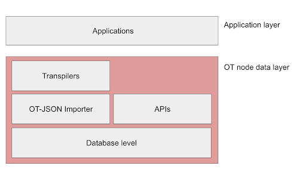

*Figure 1.* Data layer structural diagram

Applications access the information on the ODN via an OriginTrail gateway node.
A node can perform local and network queries, resulting in populating it’s local database(s).
The data layer consists of **one or more databases**, multiple **APIs**, versioned OT-JSON **importers** and **converters**.

Vocabulary definition
-----------------------

- **Application (app)**: a software based system that interacts with the data layer via one of the APIs (internal or external). Internal APIs are used by the OT node, while external APIs are used by remote applications
- **API**: Programmable interface that is used to interact with the data layer
- **Blockchain network**: A specific blockchain network that can be identified by name and/or network identifier (i.e. Ethereum Rinkeby testnet, Ethereum mainnet etc)
- **Converter (formerly Transpiler)**: A converter converts a designated dataset format X into OT-JSON file format, and vice versa from OT-JSON to the format X.
- **Cryptographic key pair**: a cryptographically paired set of keys. The Public and Private key pair comprise of two uniquely related cryptographic keys (basically long random numbers).
- **Consensus check**: Operation of comparing value sets from two or more data sources regarding a specific object of mutual interest
- **Database**: any data storage system supporting the use cases of the data layer
- **Dataset**: A standardised file that can be converted to OT-JSON graph format. Example: GS1 EPCIS file
- **Dataset ID**: The system wide identifier for a dataset, which is the result of the cryptographic hashing of the original dataset. At this time, it is equal to the SHA3-256 hash of the dataset.
- **Dataset hash**: The cryptographic hash of the original dataset.
- **Data life span**: The amount of time of how long a dataset replication should be retrievable in minutes
- **Dataset issuer**: A person or system that provides the standardized dataset and introduces is to the node
- **Data standard**: A specified set of rules regarding structuring of the datasets, usually issued by a specific organization such as GS1
- **Data standard ID**: A system wide defined string representing a data standard
- **Data standard schema**: A document schema describing the dataset according to the data standard.
- **Data source**: A system which is able to output datasets in digital format. An example would be a traditional supply chain ERP system, IoT enabled device, cell phone etc.
- **Graph**: A mathematical representation of objects (entities, vertices) and their relations (edges, connections) based on mathematical graph theory
- **Graph elements / entities**: Vertices and Edges in the graph
- **Identifier**: Any string that is specifically designated as an identifier of graph entities
- **Issuer identity**: A decentralized identity associated with cryptographic key pairs belonging to the dataset issuer
- **Merkle proof**: A set of Merkle Tree leaves needed to verify that the Merkle Root hash corresponds to a specific original dataset
- **Merkle Tree**: a tree in which every leaf node is labelled with the hash of a data block, and every non-leaf node is labelled with the cryptographic hash of the labels of its child nodes
- **OT-JSON**: Native ODN data layer file format containing the data represented as a graph, signed by the issuers cryptographic key
- **OT Node**: OriginTrail Network Node, a unit of the OriginTrail Network
- **OriginTrail Network**: A network consisting of OT Nodes
- **Root hash**: The root node cryptographic hash of the Merkle tree produced from the dataset

Architecture proposal
----------------------

The V4 data layer architecture is a multi level architecture, following ANSI-SPARC architecture guidelines for separation of levels.

.. image:: architecture-img.png
   :width: 400px

*Figure 1.* ANSI-SPARC architecture

On the top level of OT data layer is the external level, defined by external standards, such as GS1, WOT, etc. Files from the external level are converted to the conceptual level, which uses the OT-JSON structure for representation of files. OT-JSON represents the main data structure in OT data layer. To store the OT-JSON document, it is required for the document to be first converted to the internal level, separating the dataset graph data and dataset metadata into separate JSON structures. Finally, the internal level is converted to the  database level which stores all the data in the database(s). It is important that all conversion operations are reversible, so that the data from the  database level can be restored back to external level without loss of information.

*Figure 2.* OT Datalayer architecture

Data layer acceptance criteria
--------------------------------

Data layer requirements & User stories
~~~~~~~~~~~~~~~~~~~~~~~~~~~~~~~~~~~~~~~~~~~~

General use case related requirements

**Requirement id**: R1
    - **Requirement name**: Storing / reading arbitrary data in a graph
    - **Requirement story**: As an app I can store arbitrary data in a graph and retrieve it back.
    - **Requirement type**: Boolean (True)

**Requirement id**: R2
    - **Requirement name**: Identifying use case entities/events by one or multiple identifiers
    - **Requirement story**: As an app I can identify graph entities by one or more identifiers.
    - **Requirement type**: Boolean (True)

**Requirement id**: R3
    - **Requirement name**: Returning all data related to a specific identifier according to specific filters on a graph level (i.e. all business locations that have been involved with a certain truck with an ID)
    - **Requirement story**: As an application I can fetch all graph data related to an identifier X according to available filters.
    - **Requirement type**: Boolean (True)

**Requirement id**: R4
    - **Requirement name**: Creating relations between entities and files/documents
    - **Requirement story**: As an app I can connect different graph entities through the internal API.
    - **Requirement type**: Boolean (True)

**Requirement id**: R5
    - **Requirement name**: Verification/Provenance of data integrity
    - **Requirement story**: As an app I can find a corresponding fingerprint on a blockchain, as well as retrieve a Merkle proof related to part of the dataset that was returned from a traversal query.
    - **Requirement type**: Boolean (True)

**Requirement id**: R6
    - **Requirement name**: Determine/Confirm data provider from the data itself
    - **Requirement story**: As an app I can identify the issuer of each graph element returned by the API.
    - **Requirement type**: Boolean (True)

**Requirement id**: R7
    - **Requirement name**: Invalidating existing datasets
    - **Requirement story**: As an app I can publish a dataset that will contain information about invalidating a previously published dataset. This dataset can contain new information previously unpublished
    - **Requirement type**: Boolean (True)

**Requirement id**: R8
    - **Requirement name**: Traversing the data with specific criteria
    - **Requirement story**: As an app I can perform the graph traversal based on a specific identifier with specific criteria (such as graph depth, connection type etc)
    - **Requirement type**: Boolean (True)

**Requirement id**: R9
    - **Requirement name**: Support ZeroKnowledge applications for quantity balances
    - **Requirement story**: As an app I can perform zero-knowledge calculations for quantity balance based on the data obtained from the graph traversal operation
    - **Requirement type**: Boolean (True)

**Requirement id**: R10
    - **Requirement name**: Support ZeroKnowledge applications for set inclusion
    - **Requirement story**: As an app I can determine if a certain piece of data is part of a zero knowledge set
    - **Requirement type**: Future

**Requirement id**: R11
    - **Requirement name**: Support future ZeroKnowledge applications
    - **Requirement story**: As an app I can expect to support future zero knowledge applications on graphs, as I can store and query them.
    - **Requirement type**: Boolean (True)

**Requirement id**: R12
    - **Requirement name**: Providing data for consensus checks across multiple dataset connections (events)events (was single event so far)
    - **Requirement story**: As an app I can determine if there was a match between two different graphs, coming from two different datasets by two different issuers which have indicated each others identities.
    - **Requirement type**: Future

**Requirement id**: R13
    - **Requirement name**: Connecting data of different data providers
    - **Requirement story**: As a node I am can connect datasets from different data issuers based on specific identifiers.
    - **Requirement type**: Boolean (True)

**Requirement id**: R14
    - **Requirement name**: Perform network queries
    - **Requirement story**: As a node I should be able to query the whole network and store the results in my local database.
    - **Requirement type**: Boolean (True)

Standards related
~~~~~~~~~~~~~~~~~~~~~

**Requirement id**: R15
    - **Requirement name**: Mapping a large number of external standards (GS1-EPCIS, WOT, DID, …) to OT-JSON format
    - **Requirement story**: As a data issuer I should be able to import any type of standardized dataset to my node as long as there is a corresponding converter created for this dataset.
    - **Requirement type**: Boolean (True)

**Requirement id**: R16
    - **Requirement name**: 1-1 backward conversion of OT-JSON to source external format
    - **Requirement story**: As a converter I can convert my designated input file format X to OT-JSON and convert the resulting OT-JSON format back to format X without any data loss.
    - **Requirement type**: Boolean (True)

**Requirement id**: R17
    - **Requirement name**: Enabling GS1 EPCIS Query mechanism
    - **Requirement story**: As an app I can use the GS1 EPCIS query mechanism API to access data on the OT node.
    - **Requirement type**: Future

Architecture related
~~~~~~~~~~~~~~~~~~~~~

**Requirement id**: R18
    - **Requirement name**: Usage of multiple databases (Database agnosticism)
    - **Requirement story**: As a developer I can utilize multiple databases in the OriginTrail data layer, provided that an appropriate database interface is created.
    - **Requirement type**: Range (> 3)

**Requirement id**: R19
    - **Requirement name**: Converter - OT-JSON decoupled architecture
    - **Requirement story**: As a converter I am not in any way dependent on the implementation of the OT-JSON importer, and vice versa.
    - **Requirement type**: Boolean (True)

**Requirement id**: R20
    - **Requirement name**: Non-blocking API for importing
    - **Requirement story**: As an API, I should not be blocked during the operation of import, whatever the import operation run time.
    - **Requirement type**: Boolean (True)

Performance related requirements
~~~~~~~~~~~~~~~~~~~~~~~~~~~~~~~~~~~

**Requirement id**: R21
    - **Requirement name**: Importing large datasets
    - **Requirement story**: As a user I should be able to import datasets of arbitrary large size. The implementation of the data layer should not provide constraints on the file size. Other limitations might exist stemming from the operating system, hardware limits or other protocol limitations.
    - **Requirement type**: Range (> 1GB)

**Requirement id**: R22
    - **Requirement name**: Challenge block response in constant time
    - **Requirement story**: As a node I should be able to challenge other nodes in short (constant) time.
    - **Requirement type**: Boolean (True)

OT-JSON essentials
---------------------

    - **Objects** - Use case entities (products, locations, vehicles, people, … )
    - **Relations** - Relations between use case entities (INSTANCE_OF, BELONGS_TO, … )
    - **Metadata** - Data about dataset (integrity hashes, data creator, signature, transpilation data, ....)

**Example**

Assuming that use case request is to connect products with factories there they are produced. Entities of the use case are Product and Producer.
 These entities are represented as **objects** in OT-JSON format. Product can have **relation** PRODUCED_BY with producer that produces it and the producer
 can have **relation** HAS_PRODUCED with the product. Product and producer have unique identifiers Product1, Producer1 respectively.

*Figure 2.* Diagram of the example entities and relations

.. code:: json

    @graph: [
        {
            “@id”: “Product1”,
            “@type”: “OTObject”,
            “identifiers”: [
                {
                    “identifierType”: “ean13”,
                    “identifierValue”: “0123456789123”,
                }
            ],
            “properties”: {
               “name”: “Product 1”
               “quantity”: {
                   “value”: “0.5”,
                   “unit”: “l”
                }
            },
            “relations”: [
                {
                    “@type”: “OTRelation”,
                    "linkedObject": {
                            "@id": "Producer1"
                        },
                    "properties": {
                            "relationType": "PRODUCED_BY"
                        }
                }
            ]
        },
        {
            “@id”: “Producer1”,
            “@type”: “OTObject”,
            “identifiers”: [
                {
                    “identifierType”: “sgln”,
                    “identifierValue”: “0123456789123”,
                }
            ],
            “properties”: {
               “name”: “Factory 1”
               “geolocation”: {
                   “lat”: “44.123213”,
                   “lon”: “20.489383”
                }
            },
            “relations”: [
                {
                    “@type”: “OTRelation”,
                    "linkedObject": {
                            "@id": "Product1"
                        },
                    "properties": {
                            "relationType": "HAS_PRODUCED"
                        }
                }
            ]
        }
    ]

*Figure 3.* OT-JSON graph representing example entities

Conceptual essentials
------------------------

Here are some essential conceptual things related to the data in a dataset.
Try to fit example of book as an object from the physical world with its information as the data.

    - Every OT-JSON entity (Object) is identified with at least one unique identifier. An identifier is represented as a non-empty string.
    - Entities can have multiple identifiers along with the unique one. For example: EAN13, LOT number and time of some event.
    - Data can be connected by arbitrary relations. A user can define own relations that can be used with others defined by standard.
    - Relations are directed from one entity to another. It is possible to create multiple relations between two objects in both directions.

OT-RFC-02 - Data Layer v4 API
===============================

Introduction
----------------

The upcoming version of the OriginTrail node (v4 - Freedom-Gemini release) will entail a new version of the protocol data layer with an updated API based on the usage experience of the ODN mainnet. The purpose of this document is to present the design of the next version of the node Data layer API in detail and attract community improvement proposals, feedback and any additional productive ideas that might positively influence the design of the protocol and solutions built using it.

The release of the v4 node is scheduled for Q4 2019.

Important note on compatibility
---------------------------------

The proposed solution introduces several breaking changes while aiming to solve current API limitations. Import with automatic replication is not supported anymore. Furthermore import, replication and export API routes are designed to be non-blocking which changes the way they are utilized.

Solution proposition
-----------------------

API Handlers
~~~~~~~~~~~~~

To eliminate blocking calls and avoid long wait times for API calls, handlers are returned when requesting operations which take time to process. The handler value is generated as a UUID v4 and used throughout the operation as the request ID.
This value later can be used in queries to retrieve the status of the operation along with the appropriate data.
A global expiration time should be defined for handlers, after this period both the handler and the result will be deleted. This expiration time should be a customizable field in a node’s configuration.

API Reference and call explanation
-----------------------------------

Import
~~~~~~~~
When a user wishes to import a specific dataset into the node database by using the import API route, the node will transform the input dataset into graph form and store it into its graph database. The import request will generate a handler that is used later to query the import status. The queried result will return a data field with relevant information about the import, along with the status field.
If an import fails to complete for any reason, the data field will contain the error message and the status field will marked as FAILED.

Replication
~~~~~~~~~~~~

When a user wishes to replicate the imported dataset to the network, the replicate API is called. The node will publish an offer to the network, wait for potential holding nodes to apply, choose a tuple of holder identities that present a solution to fit the offer task criteria, and finalize the offer.
The replication request will generate a handler which is used later to query the replication status. The queried status will return data field with relevant information about the replication, along with the status field.
If the replication fails to be completed for any reason, the data field will contain the error message, and the status field will be FAILED.

Export
~~~~~~~~~~~~

When a user wishes to export a specific dataset from its database into original format or OT-JSON format, the export api is called, and the node will retrieve the dataset from its database, and convert it.
The export request will generate a handler which is used later to query the export result. Queried result will return data field with the stringified document, along with the status field.
If the export fails to be completed for any reason, the data field will contain the error message, and the status field will be FAILED.

Object trail
~~~~~~~~~~~~~~

Traverses the graph based on a specific identifier with specific criteria to find connected objects. It will return arrays of vertices and edges.

Get dataset information
~~~~~~~~~~~~~~~~~~~~~~~~~~

Provides information about a single dataset from the graph database.

Get a list of datasets containing identifiers
~~~~~~~~~~~~~~~~~~~~~~~~~~~~~~~~~~~~~~~~~~~~~~

Retrieves information for all the datasets that match provided identifiers.

List supported standards
~~~~~~~~~~~~~~~~~~~~~~~~~~~

Returns currently supported standards for import and export of datasets, OT-JSON included.

List available API versions
~~~~~~~~~~~~~~~~~~~~~~~~~~~~

Returns available API versions. Latest production version could be used with the tag /api/latest/.

Global status codes
---------------------

Standard REST HTTP codes should be applied to all APIs

.. csv-table::
   :header: "Code", "Description"

   "200",  "OK"
   "400",  "Bad input parameter. Error message should indicate which one and why"
   "401",  "Unauthorized request. This can happen if the bad token is used or if the caller’s IP hasn’t been added on the node’s whitelist"
   "404", "Resource not found"
   "500", "Internal server error"

Additional specific codes may be defined per route.

API versioning
---------------------

Versioning is done through URL by including a version number. Version numbers should be in the format  v2.0 where ‘2’ represents a major update and ‘0’ a minor one, for example /api/v2.0/route. API will regularly get updates with new features, bug fixes, and performance improvements. The latest tag will always point to the latest production ready API, /api/latest/route.

API specification
---------------------

Import request
~~~~~~~~~~~~~~~~~

**Requirements: [R1, R5]**
**Method**: POST
**Request route**: /api/{version}/import
**Description**: Initiates an import process. Import process can include a converter if the provided file is not in OT-JSON format which will convert a file from one of the supported formats to OT-JSON and then import OT-JSON into the graph database. Returns internally generated handler (UUID) for this import.

**Request Body**:

multipart/form-data

.. csv-table::
   :header: "Name", "Required", "Type", "Description",

   "file",  "true", "file or text", "Contains the dataset that will be imported into the database.",
   "standard_id",  "true", "text", "Specifies data standard. Currently, accepted value is GS1-EPCIS and OT-JSON",
   "standard_version",  "true", "text", "Standard version number. Can be obtained through List supported standards call",

**Response Body**:

application/json

.. csv-table::
   :header: "Name", "Type", "Description",

   "import_handle", "text", "Generated import handle",

**Example request and response:**

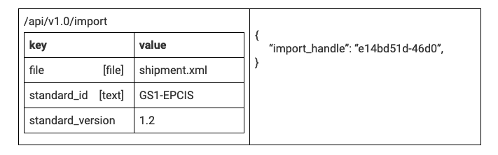

Import result
~~~~~~~~~~~~~~

| **Method**: GET
| **Request route**: /api/{version}/import/result/{import_handle}
| **Description**: Returns relevant information for this import. When the file has been imported, status will become COMPLETED, before that it will remain PENDING.

| **Request Body:**
| empty

| **Response Body:**
| application/json

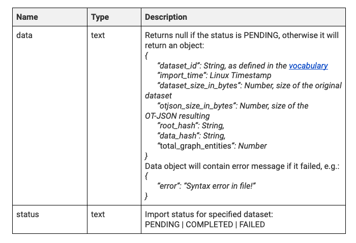

**Example request and response:**

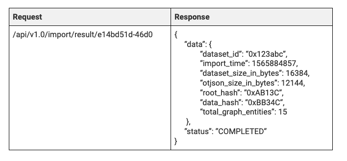

Replication request
~~~~~~~~~~~~~~~~~~~~

| **Requirements**:
| **Method**: POST
| **Request route**: /api/{version}/replicate
| **Description**: Creates an offer on ODN and replicates the dataset

**Request Body:**
application/json

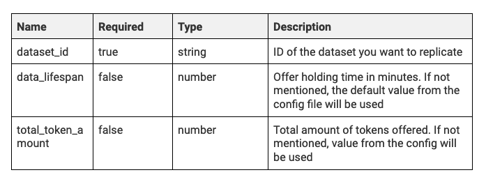

**Response Body:**
application/json

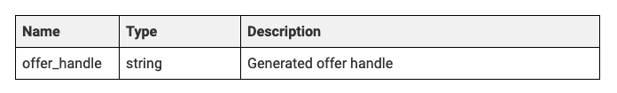

**Example request and response:**
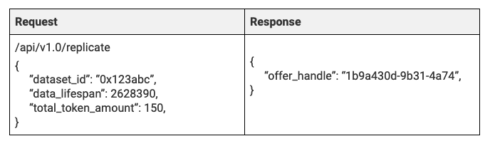

Replication result
~~~~~~~~~~~~~~~~~~~~

| **Method**: GET
| **Request route**: /api/{version}/replicate/result/{offer_handle}
| **Description**: Returns relevant information for this replication. When the holders have been chosen, status will become COMPLETED, before that it will show the current phase.

| **Request Body**:

| **Response Body**:
| application/json

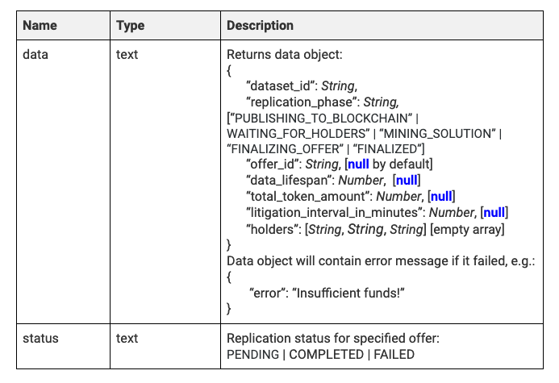

**Example request and response:**

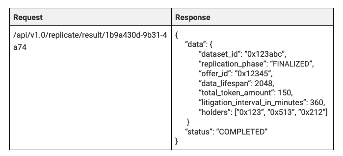

Export request
~~~~~~~~~~~~~~~~~~~~

| **Requirements: [R1]**
| **Method**: POST
| **Request route**: /api/{version}/export
| **Description**: Initiates export of a dataset from the graph database into desired format. The list of supported formats can be obtained by calling GET /api/{version}/supported_standards . By default export is available in OT-JSON and the original dataset format. In case a conversion from one format to another is not possible, the API will return code 400. Returns internally generated handle (UUID) for this export.

| **Request Body**:
| application/json

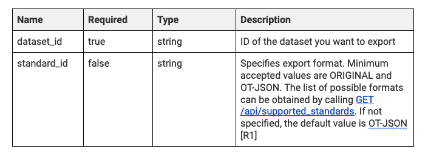

| **Response Body**:
| application/json

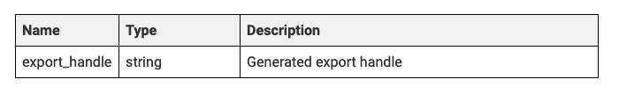

**Example request and response:**

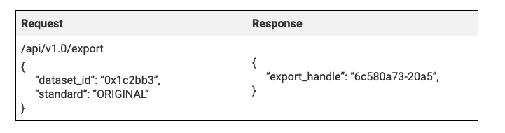

Export result
~~~~~~~~~~~~~~~~~~

| **Method**: GET
| **Request route**: /api/{version}/export/result/{export_handle}
| **Description**: Returns exported dataset. When the dataset has been converted, the status will become COMPLETED, before that it will remain PENDING.

| **Request Body**:

| **Response Body**:
| application/json

**Example request and response:**

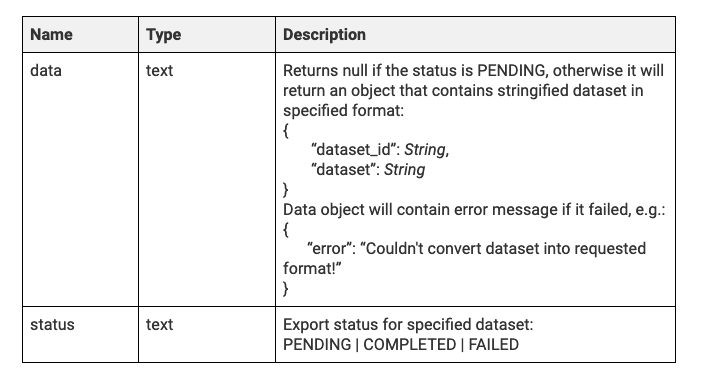

Object trail
~~~~~~~~~~~~~~~~

| **Requirements covered**: [R2, R3, R5,R6,R8]
| **Method**: POST
| **Request route**: /api/{version}/trail
| **Description**: Traverses the graph based on a specific identifier (which determines the starting vertex) and specific criteria (depth and connection types). When graph traversal is completed, the call will return arrays of vertices and edges are returned, including the array containing proofs and dataset_ids for the datasets from which the vertices and edges originate from. The proof definition is part of a separate document, TBD and linked here.

| **Request Body**:
| application/json

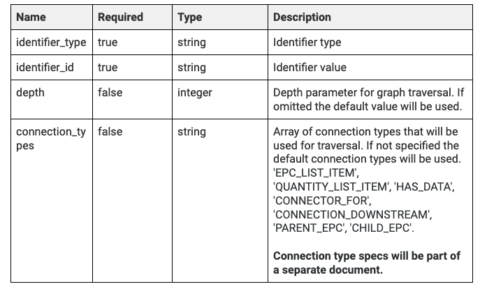

**Response Body**:
application/json

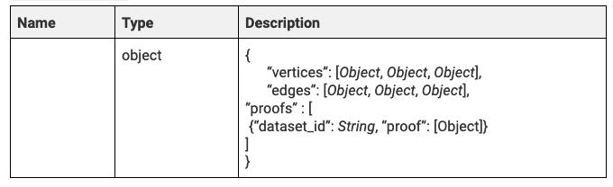

**Example request and response**:

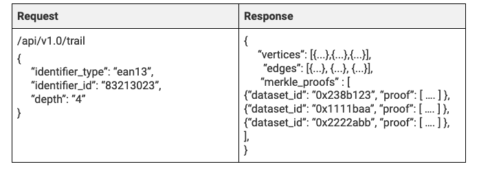

**Get dataset information**

| **Requirements**: [R3]
| **Method**: GET
| **Request route**: /api/{version}/get_dataset_info/{id}
| **Description**: Return info on the dataset with specific identifier, without returning the dataset.

| **Request Body**:

| **Response Body**:
| application/json

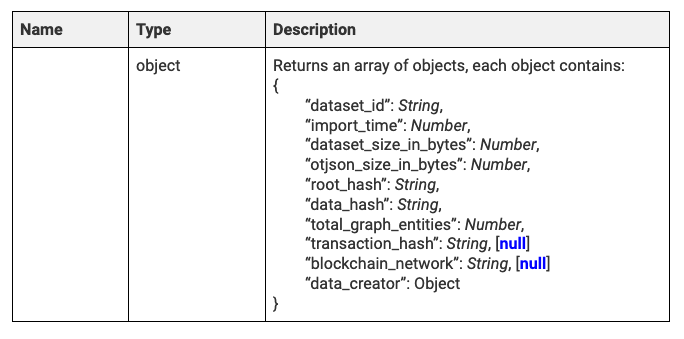

**Example request and response:**

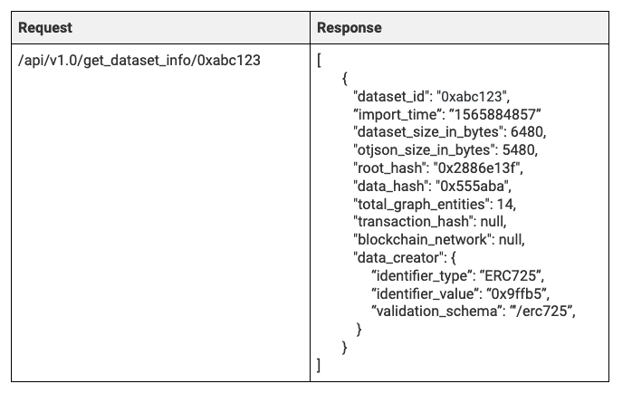

**Get a list of datasets containing identifiers**

| **Requirements**: [R3]
| **Method**: POST
| **Request route**: /api/{version}/get_datasets_with_identifiers
| **Description**: Return info on all datasets containing given identifiers. If identifiers are not provided, returns all datasets in the node’s graph database. The call will return a list of objects in which every object describes one dataset.

| **Request Body**:
| application/json

.. image:: slika23.png

| **Response Body**:
| application/json

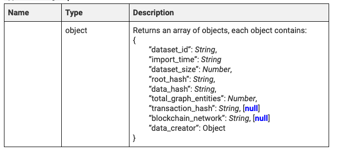

**Example request and response:**

.. image:: slika25.png

List supported dataset standards
~~~~~~~~~~~~~~~~~~~~~~~~~~~~~~~~~~

| **Method**: GET
| **Request route**: /api/{version}/supported_standards
| **Description**: Returns a list of supported standards. Standard ID (as defined in the vocabulary) is used across the system.

| **Request Body**:

| **Response Body**:
| application/json

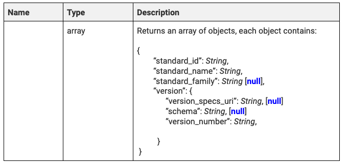

**Example request and response:**

.. image:: slika27.png

List available API version
~~~~~~~~~~~~~~~~~~~~~~~~~~~~~~

| **Method**: GET
| **Request route**: /api/versions
| **Description**: Returns a list of the available versions. /api/latest/ will point to the latest version in production. Higher versions than latest might be available and used as beta.

| **Request Body**:

| **Response Body**:
| application/json

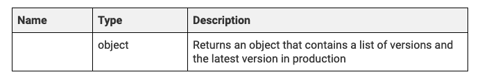

**Example request and response:**

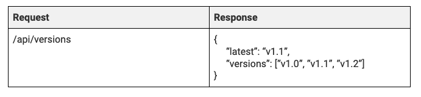

| Swagger link:
| `<https://app.swaggerhub.com/apis-docs/otteam3/data-layer-2-api/v1.0#/default/post_api__version__trail>`_

OT-RFC-03: OriginTrail v4 Data Layer - OT-JSON v1.0 data structure
=====================================================================

Abstract
----------

The graph ontology and data structures that define entities and relations in resulting protocol datasets should be designed in a loose form that supports a large number of use cases but with the basic elements that are strictly defined. Defined data structures have to be database agnostic and standard agnostic in order to support a wide variety of possible data sources and inputs.

Proposed solution
-------------------

The V4 data layer is based on new generic data structure, OT-JSON. The proposed data format for OT-JSON is based on the JSON-LD format. OT-JSON data structure should be:

    - 1-1 convertible from/to higher level data formats (XML, JSON, CSV, … )
    - 1-1 convertible from/to generic graph data structure.
    - Generic, use case agnostic
    - Support all current use cases,
    - Extendable for future, currently unpredicted, use cases
    - Versionable

OT-JSON document should represent a dataset as a graph of interconnected dataset objects (use case entities), such as actors, products, batches, etc. together with relations between them. Structure of dataset objects should be generally defined, but extendable to support new use cases.

*Figure 1.* Graphical representation of OriginTrail data layer structure and position of
            OT-JSON middle layer

Dataset structure
------------------

OT-JSON dataset is the main structure of objects that are transferred in the OriginTrail network. The structure of dataset consists of **dataset header**, **dataset graph** and **dataset signature**. Dataset header contains dataset metadata, such as dataset timestamp, data creator information, transpiler data, verification schemes versions etc.
Identifier of a dataset is calculated as a SHA3-256 digest of dataset header and dataset graph sections. Dataset signature is calculated for the canonicalized form of the entire, unsigned, dataset object.

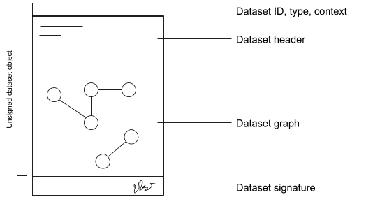

*Figure 2.*  Graphic representation of a dataset

**Example**

.. code:: json

    {
      "@type": "Dataset",
      "@id": "0x123456789034567894567890",

      "datasetHeader": {...},

      "@graph": [...],

      "signature": {...}
    }

*Example 1.* Dataset structure example

Attribute definitions
~~~~~~~~~~~~~~~~~~~~~~

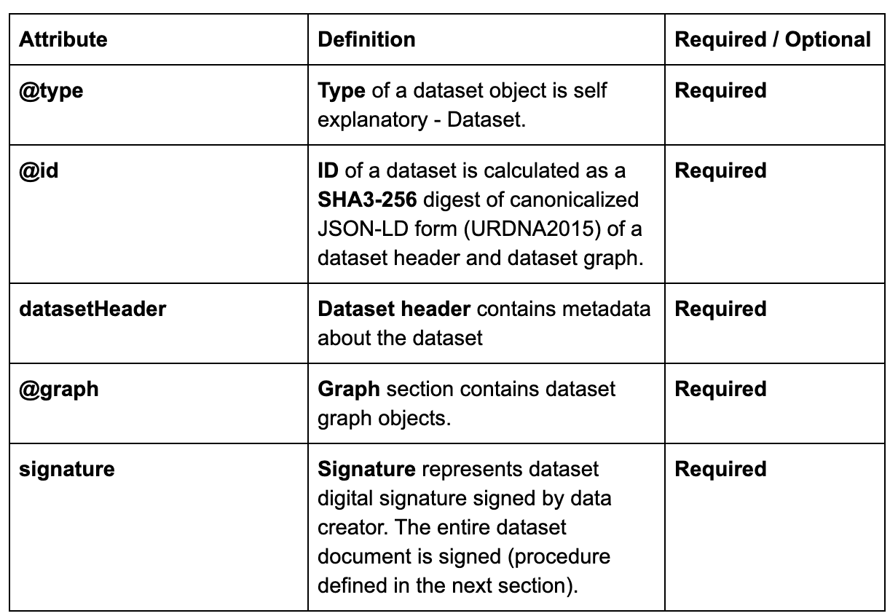

Dataset header
~~~~~~~~~~~~~~~

Dataset header contains metadata information about dataset, transpilation process from:

    - Version of OT-JSON document
    - Dataset creation timestamp
    - Dataset title
    - Dataset tags
    - Related datasets
    - Validation schemas
    - Data validation information
    - Data creator
    - Transpilation information

.. code:: json

    "datasetHeader": {
        "OTJSONVersion": "1.0",
        "datasetCreationTimestamp": "2019-01-15T09:43:58Z",
        "datasetTitle": "",
        "datasetTags": [...],

        "relatedDatasets": [{
           "datasetId": "0x232134875876125375761936",
           "relationType": "UPDATED"
           "relationDescription": "...",
           "relationDirection": "direct"
        }],

        "validationSchemas": {
          "erc725-main": {
            "schemaType": "ethereum-725",
            "networkId": "1",
            "networkType": "private",
            "hubContractAddress": "0x2345678902345678912321"
          },

          "merkleRoot": {
            "schemaType": "merkle-root",
            "networkId": "1",
            "networkType": "private",
            "hubContractAddress": "0x2345678902345678912321"
          }
        }

        "dataIntegrity": {
          "proofs": [
            {
              "proofValue": "0x54364576754632364577543"
              "proofType": "merkleRootHash"
              "validationSchema": "/schemas/merkleRoot"
            }
          ],
        },

        "dataCreator": {
          "identifiers": [
             {
              "identifierValue": "0x213182735128735218673587612",
              "identifierType": "ERC725",
              "validationSchema": "/schemas/erc725-main"
             }
            ],
          },
        },

        "transpilationInfo": {
          "transpilerType": "GS1-EPCIS",
          "transpilerVersion": "1.0",
          "sourceMetadata": {
            "created": "",
            "modified": "",
            "standard": "GS1-EPCIS",
            "XMLversion": "1.0",
            "encoding": "UTF-8",
          },
          "diff": {...}
        }
      }
    }

*Example 2.* Dataset header structure example

Validation schemas
~~~~~~~~~~~~~~~~~~~~

Validation schemas are objects that provide information on how to validate specific values, like identifiers and hashes. Schemas can contain addresses of smart contracts where identifiers are created, network identities, locations of proof hashes, etc.

Attribute definitions
~~~~~~~~~~~~~~~~~~~~~~

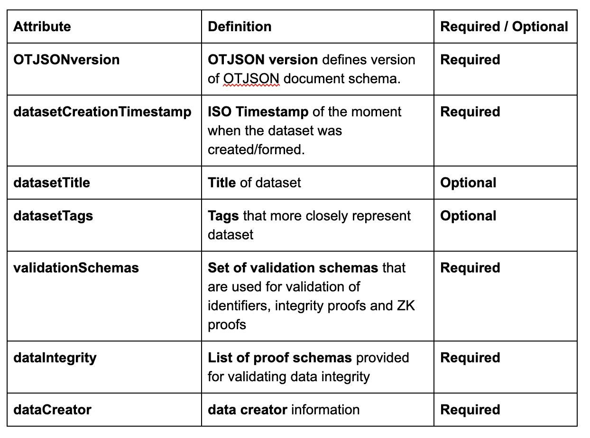

Signing
--------

When the unsigned OT-JSON document is formed, resulting object is canonicalized (serialized) and prepared for signing by data creator. Dataset signing process can be done using different signature schemas/suits. The canonicalization of OT-JSON dataset is creating sorted stringified JSON object.

Structure of a signature object is defined according to selected signature suit specifications.
Signing is done using Koblitz elliptic curve signatures (Ethereum private keys).

Also, id using JSON-LD as a format for OT-JSON, Koblitz 2016 signature suit can be used.

**Example of JSON-LD Koblitz signature 2016 Signature Suite**

The entire JSON-LD dataset document is canonicalized using URDNA2015 algorithm for JSON-LD canonicalization. Resulting N-QUADS data is digested using SHA256 algorithm. Finally, the digest is signed with ECDSA private key using Koblitz elliptic curve. Koblitz curve is used for generating Ethereum and Bitcoin wallets, so private keys for Ethereum and Bitcoin wallets can be used for signing.

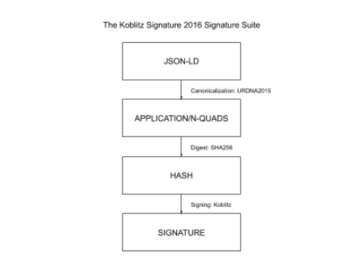

*Figure 3.*  Diagram of dataset signing procedure using Koblitz Signature 2016 Signature Suite

Object structure
-----------------

OT-JSON dataset objects represent entities which can be interconnected with relations in a graph-like form. Every OT-JSON dataset object is required to have it’s **unique identifier** (@id),
**type** (@type) and **signature**. Other, optional, sections include identifiers, properties, related objects, attachments.

Attribute definitions
~~~~~~~~~~~~~~~~~~~~~~

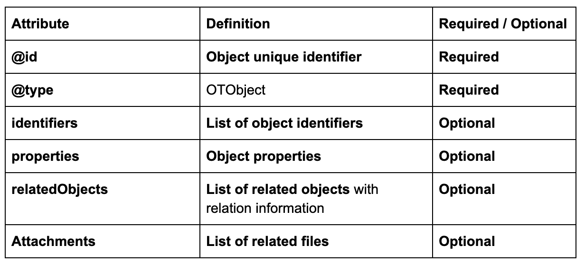

.. code:: json

    {
        “@id”: <UNIQUE_OBJECT_IDENTIFIER>
        “@type”: <OBJECT_TYPE>

        “identifiers”: [...],

        “properties”: {...},

        “relatedObjects”: [...],

        “attachments”: [...],

        “signature”: {...}
    }

*Example 3.* Dataset object structure template

Object identifiers section
~~~~~~~~~~~~~~~~~~~~~~~~~~~

Object identifiers section is a list of objects that represent identifier values for certain object.
Identifier objects contain information about **identifier type**, **identifier value**, and **validation schema** that is used for validating identity.

.. code:: json

    “identifiers”: [
      {
        “identifierType”: “sgtin”,
        “identifierValue”: “1234567.0001”,
        “validationSchema”: “/datasetHeader/validationSchemas/urn:ot:sgtin”
      },
      {
        “identifierType”: “sgln”,
        “identifierValue”: “3232317.0001”,
        “validationSchema”: “/datasetHeader/validationSchemas/urn:ot:sgln”
      }
    ]

*Example 4.* Example of identifiers section

Attribute definitions
~~~~~~~~~~~~~~~~~~~~~~

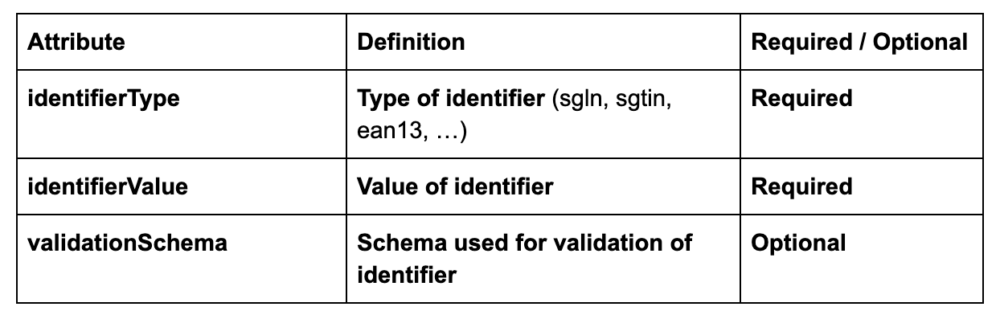

Object properties section
~~~~~~~~~~~~~~~~~~~~~~~~~~

Object properties section is defined as container for all object property attributes. OT-JSON does not provide specific rules for structuring object properties, those rules are defined within recommendations and data formatting guidelines.

Object Related objects section
~~~~~~~~~~~~~~~~~~~~~~~~~~~~~~~

Related objects section is a list of objects that represent information about other objects that are related with the object and definitions of those relations.
Objects in related objects list contain information about **linkedObject** (@id), **related object type** (@type), **relation direction**, **properties** containing additional information about the relation
and **relation type**.

.. code:: json

    “relations”: [
            {
                “@type”: “OTRelation”,
                “linkedObject”: {
                    “@id”: “<OBJECT ID>”,
                }
                “properties”: {...},
                “relationType”: “PART_OF”,
                “direction”: “direct”
            }
        ]

*Example 4.* Example of related entities section

Attribute definitions
~~~~~~~~~~~~~~~~~~~~~~

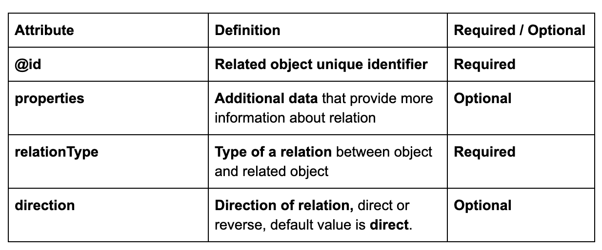

Attachments section
~~~~~~~~~~~~~~~~~~~~

Attachments section contains a list of objects that represent metadata about files that are related with the object.
Objects in attachment section list contain information about related **file id** (@id, as URI), **attachment type** (@type),
**attachment role** (such as certificate, lab results, etc.), **attachment description**, **attachment file type**, and **SHA3-256** digest of a file content.

.. code:: json

    “attachments”: [
            {
                “@id”: “0x4672354967832649786379821”,
                “@type”: “Attachment”,
                “attachmentRole”: “Certificate”,
                “attachmentDescription”: “...”,
                “fileUri”: “/path/file.jpg”,
                “metadata”: {
                  “fileType”: “image/jpeg”,
                  “fileSize”: 1024
                 }
            }
        ]

*Example 4.* Example of attachments section

Attribute definitions
~~~~~~~~~~~~~~~~~~~~~~

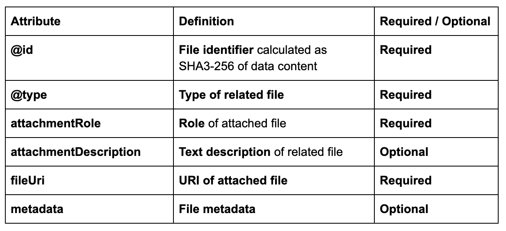

Connector objects
------------------

Special type of graph objects are **Connectors**. Connectors are used to connect data from multiple datasets of possibly different data providers.
Every connector contains *connectionId* attribute, which represents value on which connectors are connected to each other. Also, the list expectedConnectionCreators contains list of data creators that are allowed to connect to a connector.

.. code:: json

    {
        “@type”: “OTConnector”,
        “connectionId”: “1A794-2019-01-01”,
        “expectedConnectionCreators”: [
         {
            “identifierType”: “ERC725”,
            “identifierValue”: “0x5678456976546485645749”,
            “validationSchema”: “../ethereum-erc”,
         }
      ]
    }

*Example 5.* Example of attachments section

OT-RFC-04: OriginTrail Data Layer - Graph data structure (internal level)
===========================================================================

Abstract
---------

The OT-JSON document represents a specific form of container structure for graph-like, interconnected dataset objects. To import data from OT-JSON into a certain database, it is required to first transform the graph data into more generic graph structure, enabling high database agnosticism. Attached dataset metadata (non graph data) should also be extracted from the originating OT-JSON file and processed, including the attached signatures.

Proposed solution
------------------

The proposed solution requires the middleware OT-JSON structure to be converted into a generic, database agnostic graph data structure, before importing into a specific database. The resulting graph structure should be:

    - Structured as lists of graph vertex and edge objects that represent entities and relations between them, respectively (ER model)
    - Use case agnostic
    - Excluded from any business logic
    - 1-1 transformable from and to OT-JSONs graph section

Dataset metadata should also be extracted from OT-JSON and stored as JSON object independently of graph data. The way of storing graph and metadata is left to the database layer.

*Figure 1.* Architecture of Internal level

Internal Level Architecture
----------------------------

The graph data and dataset metadata, extracted from OT-JSON are, separated into two JSON/JSON-LD objects. Both resulting JSON-LD objects are, together, 1-1 transformable back to OT-JSON format.

Graph Data Structure
~~~~~~~~~~~~~~~~~~~~~

Graph data structure is represented as JSON-LD object with two lists of objects:
    - Vertex objects
    - Edge objects

.. code:: json

    {
      “vertices”: [...],
      “edges”: [...]
    }

*Example 1.* Structure of graph data object

Vertex objects
~~~~~~~~~~~~~~~

Vertex objects are JSON objects. Every vertex is identified by its unique key, 32 bytes string. Also, vertex object contains unique identifier uid string of an entity that it is representing and data object with entity properties.

.. code:: json

    {
      “key”: “1ab2c3d4e5f611ab2c3d4e5f611ab2c3”,
      “uid”: “entity:unique:identifier:123”,
      “data”: {
        “objectType”: “Product”,
        “someEntityProperty”: “someValue”
      }
    }

*Example 2.* Structure of graph data vertex object

Edge objects
~~~~~~~~~~~~~

Edge objects are also represented as JSON objects. Edge objects are identified with unique **key**, 32 bytes string, just as vertex key.
Keys of vertices that are connected with edge, are provided within attributes **from** and **to**. Properties of the relation that is represented with the edge is stored in edge’s **data** object.

.. code:: json

    {
      “key”: “f2b2f3dfe5a611ab2c3d4e5f611ab2c3”,
      “from”: “11a3c3d4e5f611ab2c3d4e5f611ab2c3”,
      “to”: “22b2c3d4e5f611ab2c3d4e5f611ab2c3”,
      “data”: {
        “relationType”: “PART_OF”,
        “someRelationProperty”: “someValue”
      }
    }

*Example 3.* Structure of graph data vertex object

Dataset metadata
------------------

Dataset metadata is represented as JSON object which contains metadata from OT-JSON document. Metadata contains dataset id, header, signature, and key values of all vertices and edges.

.. code:: json

    {
      “datasetId”: “0x23478767865345768976”,
      “datasetHeader”: {...},
      “signature”: {...},
      “vertexIDs”: [(keys)],
      “edgeIDs”: [(keys)],
    }

*Example 4.* Structure of dataset metadata object

OT-RFC-05: OriginTrail v4 Data Layer - Database Level Structure
==================================================================

Abstract
-----------------
The requirement of the database is efficient storage of original input data in one or more databases. As an OriginTrail dataset has two logical components, graph data and metadata, it is required for the database layer to be able to store data of those components, enabling efficient data search and traversals. Furthermore, data from vertices could be separated from graph vertices, leaving graph structure in one place (optimized for graph traversals) and vertex data in another data store (such as a NoSQL database).

Proposed solution
------------------
Graph data should be stored in graph database, separated from dataset metadata. Dataset metadata should be stored in document based / key-value database. It is possible to use multimodal databases (like ArangoDB) for storing both graph and metadata, but such operations should be performed in separate collections. The proposed solution recommends creation of new collection ot_datasets, that would contain dataset metadata, and old collections ot_vertices and ot_edges should be used for graph data.

.. image:: ../source/internal_level.png

*Figure 1*. Database level organization

Database level architecture
----------------------------
The database level consists of collections that store dataset graph data and dataset metadata. Graph data contains vertex and edge objects. Those objects are stored in the database collections named ot_vertices and ot_edges, respectively. Dataset metadata is stored in collection named ot_datasets.

Graph vertices
~~~~~~~~~~~~~~~~~~~~~
Graph vertices are divided into four types of vertices:

* Entity object vertices
* Data object vertices
* Identifier vertices
* Connectors

All vertices contain database specific attributes, such as vertex key (_key), _id, _rev, … but also a list of datasets from which they are created.

Entity Object vertices
^^^^^^^^^^^^^^^^^^^^^^^^^^^
Entity object vertices represent real world entities and events. Data stored in entity object vertices contains object type, and object unique identifier. Relations between entities are created between entity objects.

.. code:: json

   {
      “_key”: “09869878572359876123”,
      “vertexType”: “EntityObject”,
      “objectType”: “Product”,
      “uid”: “urn:ot:product:id:12345”,
      “datasets”**: [...]
   }

*Example 1*. Structure of entity object vertex

Datao bject vertices
^^^^^^^^^^^^^^^^^^^^^
Data object vertices represent data about entity that is provided within certain dataset. New data objects, related to certain entity, are created for every dataset. Data stored in data objects contains all property data from graph object and graph object signature. In the future, data vertices could be stored in separate database, ex. MongoDB.

.. code:: json

   {
      “_key”: “09869878572359876123”,
      “vertexType”: “Data”,
      “properties”: {...},
      “signature”: {...},
      “datasets”: [...]
   }

*Example 2*. Structure of data object vertex

Identifier vertices
^^^^^^^^^^^^^^^^^^^^^
Identifier vertices represent auxiliary vertices that are used for searches. Separating identifier vertices from entity object vertices enable very efficient searches by multiple identifiers as uniform, indexable objects. Identifier vertices data contains identifier type and identifier value.

.. code:: json

   {
      “_key”: “09869878572359876123”,
      “identifierType”: “ean13”,
      “identifierValue”: “123457890123”,
      “vertexType”: “Identifier”,
      “datasets”: [...]
   }

*Example 3*. Structure of identifier vertex

Connector vertices
^^^^^^^^^^^^^^^^^^^^^
Connector vertices are special type of vertices that are used for connecting graphs from multiple datasets, created by different data creators. They contain connection ID and the list of expected data creator ids that can extend the connection. Connection ID is agreed value upon which two sender can connect their data for the specific connector.

.. code:: json

   {
       “_key”: “09869878572359876123”,
       “vertexType”: “Connector”,
       “connectionId”: “1A794-2019-01-01”,
       “expectedConnectionCretors”: [
     {
        “identifierType”: “ERC725”,
        “identifierValue”: “0x5678456976546485645749”,
        “validationSchema”: “../ethereum-erc”,
       }
    ],
        “datasets”: [...]

   }

*Example 4*. Structure of identifier vertex

Edges
~~~~~~~~~~~~~~~~~~~~~
Edge objects are divided into three types:

* Entity relation edges
* Data relation edges
* Identifier relation edges
* Connector relation edges
* Dataset connection edges

All vertices contain database specific attributes, such as vertex key (_key), _id, _rev, … but also a list of datasets from which they are created.

Entity Object vertices
^^^^^^^^^^^^^^^^^^^^^^^^
All edges provide keys of connected vertices in **_from and** **_to** attributes. Also, list of origin datasets is provided. Edge type is provided within **edgeType** and relation type is provided within attribute **relationType**. Relation types are, by convention, written in uppercase snake notation.

Entity relation edges
^^^^^^^^^^^^^^^^^^^^^^
Entity relation edges represent relations between entity object vertices. They are defined on the level of OT-JSON. Specific attribute of entity relations is their direction, in a logical sense(relation direction can be opposite of edge direction), provided also in OT-JSON.

.. code:: json

   {
     “_key”: “09869878572359876123”,
     “_from”: “7863569869873265934”,
     “_to”: “8073465902642364328”,
     “edgeType”: “EntityRelation”,
     “relationType”: “TRANSFERED_FROM”,
     “relationDirection”: “direct”,
     “datasets”: [...]
   }

*Example 5*.  Structure of entity relation

Data relation edges
^^^^^^^^^^^^^^^^^^^^^
Data relation edges connect data objects with their respective entities. Data relations are directed from entity object vertices towards data object vertices.

.. code:: json

   {
      “_key”: “09869878572359876123”,
      “_from”: “7863569869873265934”,
      “_to”: “8073465902642364328”,
      “edgeType”: “DataRelation”,
      “relationType”: “HAS_DATA”,
      “datasets”: [...]
   }

*Example 6*. Structure of data relation

Identifier relation edges
^^^^^^^^^^^^^^^^^^^^^^^^^^
Identifier relation edges connect identifiers with entity objects. Identifier relations are bidirectional, having one direction defined with IDENTIFIES and the other with IDENTIFIED_BY relation type.

.. code:: json

   {
      “_key”: “09869878572359876123”,
      “_from”: “7863569869873265934”,
      “_to”: “8073465902642364328”,
      “edgeType”: “IdentifierRelation”,
      “relationType”: “IDENTIFIES”,
      “datasets”: [...]
  }

  {
      “_key”: “09869878572359876123”,
      “_from”: “8073465902642364328”,
      “_to”: “7863569869873265934”,
      “edgeType”: “IdentifierRelation”,
      “relationType”: “IDENTIFIED_BY”,
      “datasets”: [...]
  }

*Example 7*.  Structure of identifier relation

Connector edges
^^^^^^^^^^^^^^^^^^^^^
Connector edges connect connector vertices with entity object vertices. They are bidirectional, having one direction with relation type HAS_CONNECTOR and the other IS_CONNECTOR_FOR

.. code:: json

     {
          “_key”: “09869878572359876123”,
          “_from”: “7863569869873265934”,
          “_to”: “8073465902642364328”,
          “edgeType”: “ConnectorRelation”,
          “relationType”: “IS_CONNECTOR_FOR”,
          “datasets”: [...]
     }

     {
          “_key”: “09869878572359876123”,
          “_from”: “7863569869873265934”,
          “_to”: “8073465902642364328”,
          “edgeType”: “ConnectorRelation”,
          “relationType”: “HAS_CONNECTOR”,
          “datasets”: [...]
     }

*Example 8*.   Structure of event connection

Dataset connection edges
^^^^^^^^^^^^^^^^^^^^^^^^^^^
Dataset connection edges are special, auxiliary, type of edges which are created after import. They create connections between connectors and enable connecting graphs from multiple imports. Dataset connections are bidirectional, being defined with CONNECTION_UPSTREAM and CONNECTION_DOWNSTREAM relation types, representing logical dataflow. As event connections are not part of datasets, they do not contain **datasets** attributes.

.. code:: json

   {
      “_key”: “09869878572359876123”,
      “_from”: “7863569869873265934”,
      “_to”: “8073465902642364328”,
      “edgeType”: “DatasetConnection”,
      “relationType”: “CONNECTION_UPSTREAM”,
       }

       {
      “_key”: “09869878572359876123”,
      “_from”: “7863569869873265934”,
      “_to”: “8073465902642364328”,
      “edgeType”: “DatasetConnection”,
      “relationType”: “CONNECTION_DOWNSTREAM”,
   }

*Example 9*.  Structure of event connection

Dataset metadata
~~~~~~~~~~~~~~~~~~~~~
Dataset metadata objects contain metadata derived from OT-JSON dataset object, left by removing graph data. Also, metadata contain list of keys of graph edges and vertices that are contained in dataset graph.

.. code:: json

    {
      “_key”: “<DATASETID>”,
      “datasetContext”: “https://context.origintrail.io”,
      “datasetHeader”: {...},
      “datasetSignature”: {...},
      “vertices”: [“567898a67b909e767890”, “8073465902642364328”, ...],
      “edges”: [“09869878572359876123”, “e143655902642364328”, ...]
    }

*Example 10*. Structure of metadata document object
